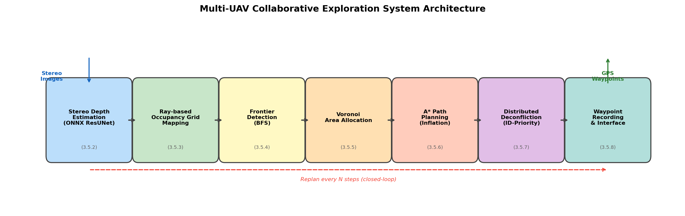
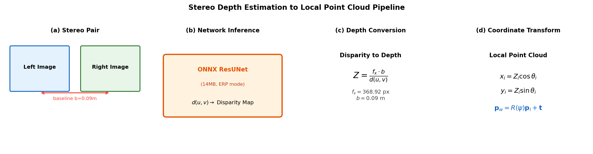
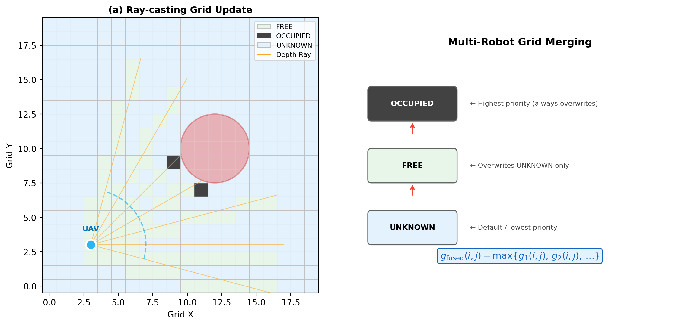
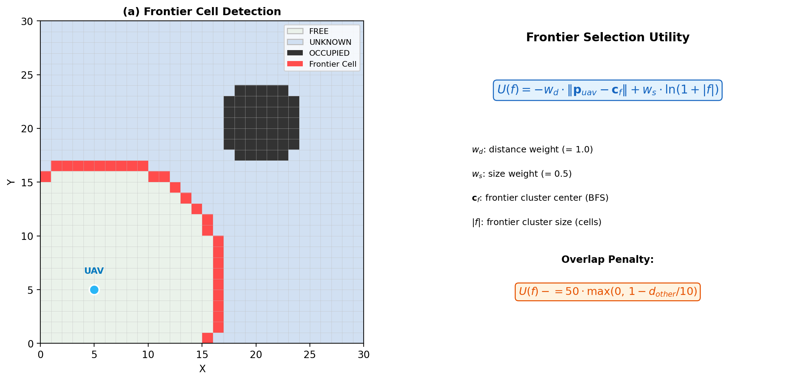
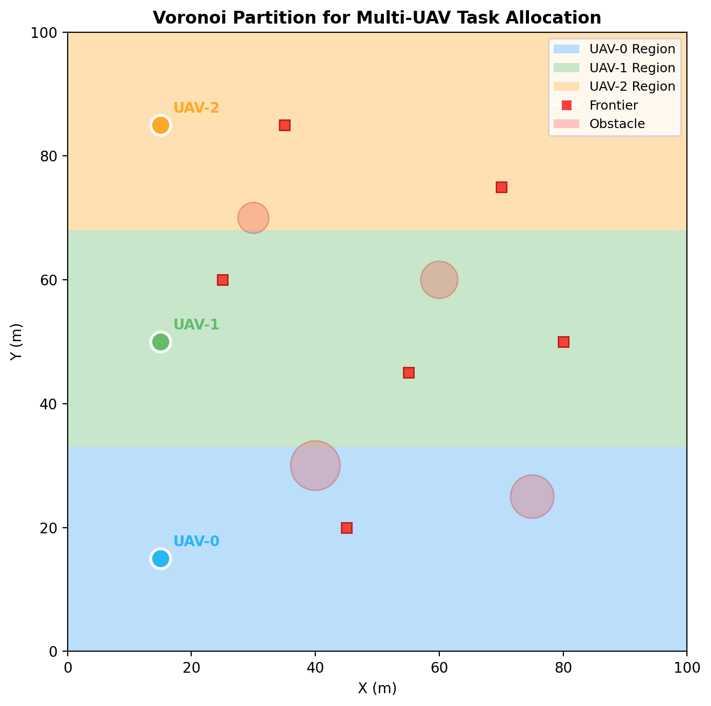
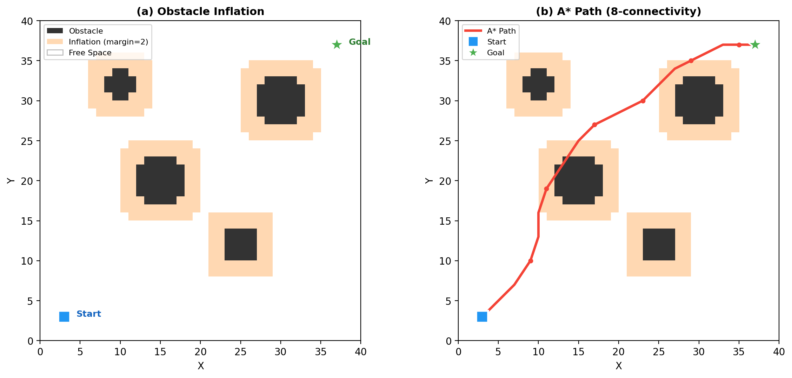
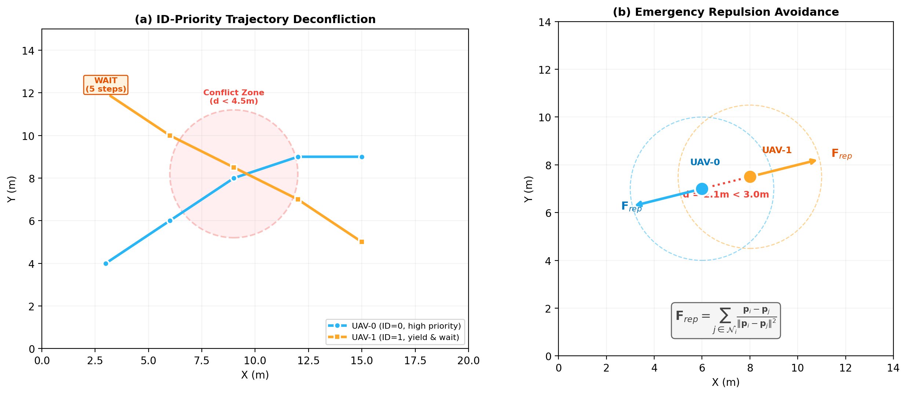
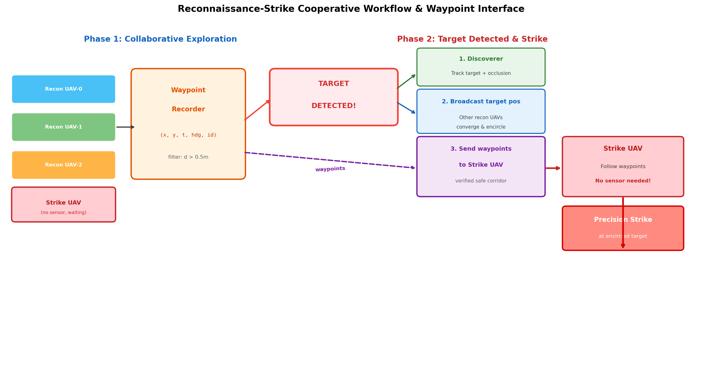

# 3.5 面向深度感知的无人机集群局部建图与避障规划方法

## 3.5.1 方法总体框架

在多无人机协同探索任务中，系统需要解决"去哪里探索"和"如何安全到达"两个核心问题。现有的 EGO-Planner-Swarm 方案聚焦于已知目标点的轨迹优化与多机避撞，依赖 ROS 和 CUDA 硬件生态，缺乏自主探索决策能力，且深度感知模块难以在嵌入式平台轻量部署。针对上述不足，本节提出一套面向深度感知的无人机集群局部建图与避障规划方法，形成从感知到决策再到执行的完整流水线。

本方法的总体架构如图所示，包含以下七个功能模块：(1) 双目深度估计模块，通过 ONNX 轻量模型或仿真射线获取前视深度信息；(2) 局部占据栅格建图模块，利用射线投射将深度数据转化为 2D 栅格地图；(3) 前沿检测模块，基于 BFS 连通分量聚类识别已知区域与未知区域的边界；(4) Voronoi 分区模块，按欧氏距离最近原则将探索空间分配给各无人机；(5) A* 路径规划模块，在膨胀后的障碍物地图上搜索无碰撞路径；(6) 分布式防撞模块，通过轨迹广播和优先级避让实现多机安全飞行；(7) 航点记录与接口模块，将探索轨迹转化为 GPS 航点供下游围捕任务使用。



与 EGO-Planner-Swarm 相比，本方法的核心差异在于：EGO-Swarm 需要外部指定飞行目标点，而本方法内置了完整的自主探索决策链（前沿检测 $\rightarrow$ Voronoi 分区 $\rightarrow$ 效用评分 $\rightarrow$ 目标选择）；在感知前端，本方法以 14MB 的 ONNX ResUNet 模型替代 CUDA 深度渲染，可在 RK3588 等嵌入式平台部署，不依赖 ROS 框架。系统采用纯 Python 实现，仿真区域为 $100\text{m} \times 100\text{m}$，栅格分辨率 $0.5\text{m}$，对应 $200 \times 200$ 的网格，支持 3 架无人机并行探索。


## 3.5.2 双目深度图到局部点云的转换

自主探索的首要环节是获取前方环境的深度信息。本方法设计了一个双模式深度估计器：在真实部署场景下，利用 ONNX 后端加载预训练的 ResUNet 立体匹配模型，从左右目 BGR 图像推理得到视差图；在仿真场景下，通过射线-圆相交检测直接获取 60 条射线的深度值。



**视差到深度的转换**。对于真实推理模式，给定左右目图像 $I_L, I_R$，ResUNet 模型输出视差图 $D(u,v)$。根据双目几何原理，深度值由下式计算：

$$z(u,v) = \frac{f_x \cdot b}{\max(D(u,v),\; 0.1)}$$

其中 $f_x = 368.92\text{px}$ 为水平焦距，$b = 0.09\text{m}$ 为双目基线距离。分母中的截断操作 $\max(\cdot, 0.1)$ 用于避免零视差导致的数值发散。

**局部点云生成**。对于仿真模式，传感器沿前视方向均匀发射 $N_r = 60$ 条射线，视场角 $\theta_{\text{FOV}} = 90°$，最大感知距离 $d_{\max} = 15\text{m}$。设第 $i$ 条射线的局部角度为 $\alpha_i$，对应深度为 $d_i$，则局部坐标系下的点云坐标为：

$$x_i^{(\text{local})} = d_i \cos\alpha_i, \quad y_i^{(\text{local})} = d_i \sin\alpha_i$$

**坐标变换**。将局部点云转换到世界坐标系，设无人机当前位置为 $\mathbf{p} = (p_x, p_y)^T$，航向角为 $\psi$，则旋转矩阵和变换关系为：

$$\mathbf{R}(\psi) = \begin{pmatrix} \cos\psi & -\sin\psi \\ \sin\psi & \cos\psi \end{pmatrix}, \quad \mathbf{q}_i^{(\text{world})} = \mathbf{R}(\psi) \begin{pmatrix} x_i^{(\text{local})} \\ y_i^{(\text{local})} \end{pmatrix} + \mathbf{p}$$

该变换将以无人机机体为原点的局部观测统一到全局坐标系下，为后续栅格建图提供一致的空间参考。

## 3.5.3 基于深度射线的局部占据栅格建图方法

获取深度数据后，需要将其转化为结构化的环境表示。本方法采用 2D 占据栅格地图，将连续空间离散化为 $200 \times 200$ 的均匀网格，每个格子维护三种状态之一：未知（UNKNOWN = 0）、空闲（FREE = 1）、占据（OCCUPIED = 2）。



**向量化射线更新算法**。对于每一帧深度观测，算法沿各射线方向进行均匀采样并更新栅格状态。设无人机位置为 $\mathbf{p}$，航向角为 $\psi$，第 $i$ 条射线角度为 $\alpha_i$（相对于机体前方），对应深度为 $d_i$。射线的绝对方向角为：

$$\theta_i = \psi + \alpha_i$$

沿射线方向以步长 $\Delta s = 0.8 \times r_{\text{grid}} = 0.4\text{m}$ 进行采样，第 $k$ 个采样点的世界坐标为：

$$x_{i,k} = p_x + k \Delta s \cos\theta_i, \quad y_{i,k} = p_y + k \Delta s \sin\theta_i$$

对于满足 $k \Delta s < d_i$ 且位于地图边界内的采样点，将其所在栅格标记为 FREE。若射线在感知范围内命中障碍物（$d_i < d_{\max} - 0.1$），则将射线终点处的栅格标记为 OCCUPIED。

**多机栅格融合**。当多架无人机在通信范围内（$R_{\text{comm}} = 80\text{m}$）交换栅格信息时，采用优先级融合策略：OCCUPIED 状态具有最高优先级，可覆盖任意状态；FREE 状态仅可覆盖 UNKNOWN；UNKNOWN 不覆盖任何已知信息。形式化表示为：

$$g_{\text{merged}}(i,j) = \begin{cases} \text{OCCUPIED}, & \text{if } g_A(i,j) = \text{OCCUPIED} \lor g_B(i,j) = \text{OCCUPIED} \\ \text{FREE}, & \text{if } g_A(i,j) = \text{FREE} \lor g_B(i,j) = \text{FREE} \\ \text{UNKNOWN}, & \text{otherwise} \end{cases}$$

与 EGO-Swarm 的 3D 体素栅格（分辨率 0.1m）相比，本方法采用 2D 栅格（分辨率 0.5m），在保证足够的障碍物表征精度的前提下，大幅降低了存储开销和计算复杂度，整个栅格仅需 $200 \times 200 = 40\text{KB}$ 的 int8 存储空间。此外，EGO-Swarm 各机独立建图互不融合，而本方法通过栅格融合实现了多机地图共享，有助于减少重复探索。

## 3.5.4 基于前沿检测的未知区域探索方法

前沿（frontier）是已知空闲区域与未知区域之间的边界，是自主探索的天然目标。EGO-Planner-Swarm 不包含自主探索功能，需要外部系统指定飞行目标点。本方法内置了完整的前沿检测与目标选择机制，使无人机集群能够自主决定"去哪里探索"。



**前沿格子识别**。定义前沿格子为同时满足以下两个条件的栅格单元：(1) 自身状态为 FREE；(2) 其四邻域中至少存在一个 UNKNOWN 状态的格子。通过四邻域扩张操作实现高效检测：

$$F(i,j) = \mathbb{1}[g(i,j) = \text{FREE}] \;\wedge\; \bigvee_{(i',j') \in \mathcal{N}_4(i,j)} \mathbb{1}[g(i',j') = \text{UNKNOWN}]$$

其中 $\mathcal{N}_4(i,j)$ 表示格子 $(i,j)$ 的四邻域集合。

**BFS 连通分量聚类**。检测到的前沿格子通过广度优先搜索（BFS）进行连通分量分析，将相邻的前沿格子聚合为前沿簇。过滤掉尺寸小于 $S_{\min} = 3$ 格的噪声簇，保留有效前沿。每个前沿簇的代表点取为其所有成员格子坐标的均值。

**效用评分函数**。为每个前沿簇计算探索效用，综合考虑距离代价和信息增益：

$$U(f) = -w_d \cdot \|\mathbf{p} - \mathbf{c}_f\| + w_s \cdot \ln(1 + S_f)$$

其中 $\mathbf{c}_f$ 为前沿簇 $f$ 的中心坐标，$S_f$ 为其包含的格子数，$w_d = 1.0$ 为距离权重，$w_s = 0.5$ 为尺寸权重。$\ln(1+S_f)$ 采用对数变换抑制极大前沿的主导效应，使评分更加平衡。

**目标重叠惩罚**。为避免多架无人机选择相同或过近的前沿目标，引入重叠惩罚项。设其他无人机已选择的目标集合为 $\mathcal{T}$，对于候选前沿 $f$：

$$U'(f) = U(f) - \sum_{\mathbf{t} \in \mathcal{T}} 50 \cdot \max\left(0,\; 1 - \frac{\|\mathbf{c}_f - \mathbf{t}\|}{10}\right)$$

当候选前沿与已选目标距离小于 $10\text{m}$ 时，惩罚项线性增大，最大可达 50 分。

**贪心分配策略**。系统依次为每架无人机选择效用最高的前沿作为探索目标，每次选择后将其加入已选集合 $\mathcal{T}$，后续无人机的评分将受到惩罚项的约束。该贪心策略计算复杂度为 $O(N \cdot K)$，其中 $N$ 为无人机数量，$K$ 为前沿簇数量。

## 3.5.5 基于 Voronoi 分区的多无人机任务分配方法

仅依靠前沿效用评分的贪心分配难以从空间全局角度保证探索任务的均衡分工。为此，本方法引入 Voronoi 分区机制，将探索空间按最近距离原则划分给各无人机，确保每架无人机在自身负责的区域内选择前沿目标，从而实现空间层面的任务解耦。



**Voronoi 分区计算**。设 $N$ 架无人机的当前位置为 $\{\mathbf{p}_1, \mathbf{p}_2, \ldots, \mathbf{p}_N\}$，对于栅格地图上的每个格点 $(i,j)$，计算其到所有无人机的欧氏距离：

$$d_k(i,j) = \sqrt{(x_{ij} - p_{k,x})^2 + (y_{ij} - p_{k,y})^2}, \quad k = 1, 2, \ldots, N$$

其中 $(x_{ij}, y_{ij})$ 为格点 $(i,j)$ 对应的世界坐标。Voronoi 分区图定义为：

$$V(i,j) = \arg\min_{k \in \{1,\ldots,N\}} d_k(i,j)$$

即每个格点被分配给距离最近的无人机。

**前沿过滤**。在进行前沿目标选择前，每架无人机仅保留位于自身 Voronoi 区域内的前沿簇：

$$\mathcal{F}_k = \{f \in \mathcal{F} \mid V(i_f, j_f) = k\}$$

其中 $(i_f, j_f)$ 为前沿簇 $f$ 的中心坐标。通过该过滤操作，各无人机的探索目标在空间上天然分离，避免了多机同赴同一区域的资源浪费。

**与 EGO-Swarm 的对比**。EGO-Planner-Swarm 不包含任何任务分配机制，各无人机的飞行目标完全由外部人工指定。本方法通过 Voronoi 分区实现了自动化的空间任务分配，无需人工干预即可在未知环境中均衡分工。Voronoi 分区的计算复杂度为 $O(N \cdot G^2)$，其中 $G = 200$ 为栅格边长，$N = 3$ 为无人机数量，单次计算在毫秒量级即可完成。

## 3.5.6 基于障碍物膨胀与 A* 搜索的局部路径规划方法

确定探索目标后，无人机需要规划一条从当前位置到目标点的无碰撞路径。本方法采用障碍物膨胀与 A* 搜索相结合的路径规划策略，在 2D 占据栅格上实现安全高效的路径搜索。



**障碍物膨胀**。为保证无人机与障碍物之间的安全间距，在路径搜索前对障碍物区域进行形态学膨胀。设安全裕度为 $m = 2$ 个栅格（对应 $1.0\text{m}$），采用 $\text{scipy.ndimage.binary\_dilation}$ 函数，以 $(2m+1) \times (2m+1) = 5 \times 5$ 的全一结构元素对占据格子进行膨胀。膨胀后的代价地图定义为：

$$C(i,j) = \begin{cases} +\infty, & \text{if } (i,j) \in \text{Inflate}(\text{OCCUPIED}) \\ 1.0, & \text{otherwise} \end{cases}$$

**A* 搜索**。在代价地图上执行 8 方向 A* 搜索。设当前节点为 $(c_y, c_x)$，邻居节点为 $(n_y, n_x)$，移动代价为：

$$c_{\text{move}} = \begin{cases} \sqrt{2} \approx 1.414, & |dy| + |dx| = 2 \text{（对角线移动）} \\ 1.0, & |dy| + |dx| = 1 \text{（直线移动）} \end{cases}$$

节点的 $g$ 值（起点到当前节点的实际代价）和启发函数 $h$（当前节点到终点的估计代价）分别为：

$$g(n_y, n_x) = g(c_y, c_x) + c_{\text{move}} \cdot C(n_y, n_x)$$

$$h(n_y, n_x) = \sqrt{(n_y - g_y)^2 + (n_x - g_x)^2}$$

其中 $(g_y, g_x)$ 为目标格子坐标。搜索过程使用最小堆维护开放列表，按 $f = g + h$ 排序扩展节点，最大迭代次数限制为 50000 次。

**起点/终点修正**。当起点或终点因障碍物膨胀被标记为不可通行时，算法在 $10$ 格半径内搜索最近的可通行格子作为替代。

**路径简化**。A* 输出的原始路径包含大量密集航点，通过每隔 3 个点取一个的降采样策略进行简化，保留起点和终点，减少后续轨迹跟踪的计算负担。

**与 EGO-Swarm 的对比**。EGO-Swarm 采用 B-spline 梯度优化方法进行轨迹规划，将障碍物惩罚、平滑性约束和动力学限制统一到一个优化问题中求解，输出 $C^2$ 连续的参数化轨迹。本方法采用经典 A* 搜索，输出离散航点序列，实现简洁且鲁棒性强。虽然路径平滑性不及 B-spline 方案，但 A* 搜索在栅格地图上天然保证无碰撞，且每次规划耗时约 10ms（Python 实现），满足 $0.2\text{s}$ 仿真步长下的实时性要求。

## 3.5.7 基于轨迹广播的分布式多机防撞方法

多无人机同时探索时，机间碰撞是必须解决的安全问题。本方法设计了一套分布式防撞机制，每架无人机仅依据本地通信范围内邻居的信息独立决策，无需中心调度节点，具备去中心化特性。



**轨迹广播**。每架无人机在完成路径规划后，通过模拟的局域通信（类比 ROS Topic）将未来轨迹广播给通信范围（$R_{\text{comm}} = 80\text{m}$）内的邻居。

**分布式优先级规则**。为避免两架无人机互相让行导致死锁，采用基于编号的固定优先级规则：编号较小的无人机具有更高优先级。该规则的关键优势在于各机可独立计算，无需协商即可得出一致的优先级排序：

$$\text{Priority}(i) > \text{Priority}(j) \iff i < j$$

**时空冲突检测**。对于每对在通信范围内的无人机 $(i,j)$，检查其未来 $T_{\text{check}} = 20$ 步轨迹的空间距离。若存在某一时刻 $t$ 使得两机距离小于安全阈值，则判定为冲突：

$$\exists\; t \in \{0, 1, \ldots, T_{\text{check}}-1\}: \|\mathbf{p}_i(t) - \mathbf{p}_j(t)\| < R_{\text{safe}} \times 1.5$$

其中 $R_{\text{safe}} = 3.0\text{m}$ 为安全半径，乘以 1.5 的系数作为预防性扩展。

**冲突解决策略**。当检测到冲突时，优先级较低的无人机（编号较大者）执行让行操作：在当前路径前插入 5 步原地等待，即以当前位置重复 5 次作为轨迹前缀，再接原始路径。优先级较高的无人机保持原轨迹不变。

**紧急避让**。当两机实际距离已经小于 $R_{\text{safe}} \times 1.5$ 时，触发反应式紧急避让。对于无人机 $i$，计算通信范围内所有过近邻居的排斥合力：

$$\mathbf{F}_{\text{rep}}^{(i)} = \sum_{j \in \mathcal{N}_{\text{close}}(i)} \frac{\mathbf{p}_i - \mathbf{p}_j}{\|\mathbf{p}_i - \mathbf{p}_j\|^2}$$

排斥力方向归一化后作为紧急机动方向，使无人机沿远离邻居的合力方向运动。该排斥力与距离平方成反比，确保距离越近排斥力越大。

**与 EGO-Swarm 的对比**。EGO-Swarm 同样采用去中心化架构，各机异步广播 B-spline 轨迹，但其防撞通过在轨迹优化目标函数中加入与邻居轨迹的排斥惩罚项实现，属于优化层面的软约束。本方法采用硬约束策略（优先级避让 + 紧急排斥），实现更为简洁，且能严格保证安全距离。

## 3.5.8 航点保存与围捕任务接口设计

在多无人机协同作战场景中，本探索系统并非孤立运行，而是作为"侦察-打击"协同体系的上游环节。完整的任务链路如下：3 架携带感知模块的侦察无人机协同探索受限环境，实时建图并规划避障轨迹；1 架不携带感知模块的打击无人机在出发基地待命。当侦察机发现目标后，系统需要完成两项关键任务——通知其余侦察机前往目标位置实施围捕，以及向打击机传输已验证的安全航点通道使其能够穿越障碍环境精准突入。因此，航点的保存不仅是探索过程的数据记录，更是连接侦察决策与打击执行的核心桥梁。



### 航点的本质：经过验证的安全通道

航点序列的核心价值在于其**安全性已被物理验证**。侦察机在探索过程中实际飞过了这些位置，其路径经由 A* 规划器在膨胀后的障碍物地图上搜索得到，且飞行过程中未发生碰撞。这意味着航点序列隐含了完整的障碍物回避信息——打击机无需自身具备深度感知和建图能力，仅需沿侦察机留下的航点通道依次飞行，即可安全穿越复杂的障碍物环境。这种设计将昂贵的感知与决策负载集中在侦察集群，使打击机可以最大限度地简化机载设备、降低成本、提升载荷能力。

### 航点记录与过滤机制

为避免密集冗余的航点记录，采用距离阈值过滤策略。仅当无人机与上一个已记录航点的距离超过阈值 $\delta_{\text{wp}} = 0.5\text{m}$ 时才新增记录：

$$\|\mathbf{p}_{\text{curr}} - \mathbf{p}_{\text{last}}\| > \delta_{\text{wp}}$$

每个航点包含五元组信息：

$$\text{Waypoint} = (x, y, t, \psi, \text{id})$$

其中 $(x, y)$ 为 GPS 世界坐标，$t$ 为时间戳，$\psi$ 为航向角，$\text{id}$ 为所属无人机编号。在通信受限但 GPS 可用的条件下，航点以坐标形式保存，无需传输完整的栅格地图或点云数据，通信开销极低。

### 目标发现后的状态切换与协同触发

在探索阶段，各侦察机独立执行"感知→建图→前沿探索→路径规划"的闭环，各自保存飞行航点。当某一架侦察机 $i$ 识别到目标时，系统触发以下状态切换：

**(1) 发现机切换到目标跟踪状态**。由于目标可能被障碍物遮挡或发生移动，发现机启用目标遮挡检测机制（参见第三章遮挡围捕相关方法），根据目标的可见性状态在跟踪与预测之间动态切换，持续维持对目标的状态估计。

**(2) 广播目标位置给其他侦察机**。发现机通过通信链路向其余侦察机发送目标的 GPS 坐标 $\mathbf{p}_{\text{target}}$。收到消息的侦察机中止当前探索任务，切换到围捕模式，利用各自已建立的局部地图规划前往目标位置的路径，从不同方向接近目标实施多机围捕。

**(3) 向打击机传输安全航点通道**。发现机将自身保存的航点序列 $\mathcal{W}_i = \{(x_k, y_k, t_k, \psi_k)\}_{k=1}^{K}$ 传输至基地的打击机。该航点序列构成了一条从出发基地到目标区域附近的**经过验证的安全走廊**。打击机接收航点后，沿该走廊依次飞行，实现快速避障突入和精准制导。

### 打击机的航点跟踪制导

打击机不携带深度传感器和建图模块，其导航完全依赖侦察机提供的航点序列。打击机的飞行控制简化为航点跟踪问题：依据 GPS 定位，依次飞向航点序列中的下一个目标点，当与当前航点的距离小于到达阈值时切换到下一航点，直至抵达目标区域附近执行打击任务。

这种"侦察集群探路、打击机沿验证通道突入"的分工模式，具有三方面优势：第一，打击机无需感知硬件，降低了单机成本和重量，提升了有效载荷能力；第二，航点数据量小（每点仅需 4 个浮点数），即使在通信带宽受限的条件下也可快速传输；第三，侦察与打击的解耦使两类任务可以独立优化——侦察集群专注于探索效率和安全性，打击机专注于速度和精准度。

### 数据导出格式

所有航点按无人机编号组织，导出为 JSON 文件，便于跨系统传输与解析：

```json
{
  "drone_0": [{"x": 5.0, "y": 5.0, "t": 0.2, "hdg": 0.0}, ...],
  "drone_1": [{"x": 5.0, "y": 50.0, "t": 0.2, "hdg": 0.0}, ...],
  "drone_2": [{"x": 5.0, "y": 95.0, "t": 0.2, "hdg": 0.0}, ...]
}
```

## 3.5.9 本节小结

本节提出了一套面向深度感知的无人机集群局部建图与避障规划方法，形成了从感知到决策再到执行的完整技术链路。各模块的关键贡献总结如下：

(1) **双目深度估计**：以 14MB 的 ONNX ResUNet 模型替代传统 CUDA 深度渲染方案，支持嵌入式平台轻量部署，不依赖 ROS 和专用深度相机硬件。

(2) **射线投射建图**：通过向量化射线更新算法，将前视深度数据高效转化为 $200 \times 200$ 的 2D 占据栅格，并设计了 OCCUPIED 优先的多机栅格融合策略，实现地图共享。

(3) **前沿检测与目标选择**：基于 BFS 连通分量聚类识别前沿，通过距离-尺寸效用评分和重叠惩罚机制实现多机探索目标的自动选择，填补了 EGO-Swarm 缺乏自主探索决策的空白。

(4) **Voronoi 分区**：按欧氏距离最近原则将探索空间分配给各无人机，从空间层面保证任务分工的均衡性，避免多机重复探索。

(5) **障碍物膨胀 A* 规划**：通过形态学膨胀保证安全裕度，8 方向 A* 搜索保证路径无碰撞，配合降采样简化策略输出紧凑的航点序列。

(6) **分布式防撞**：基于轨迹广播和编号优先级的去中心化防撞机制，结合反应式排斥力紧急避让，在无中心调度的条件下保障多机飞行安全。

(7) **航点保存与侦察-打击接口**：侦察机在探索过程中保存经过验证的安全航点通道，目标发现后触发多机协同状态切换——发现机跟踪目标、其余侦察机围捕、打击机沿验证通道无感知突入。航点序列是连接侦察决策与打击执行的核心桥梁，以极低的通信开销实现了感知能力从侦察集群向打击机的有效传递。
