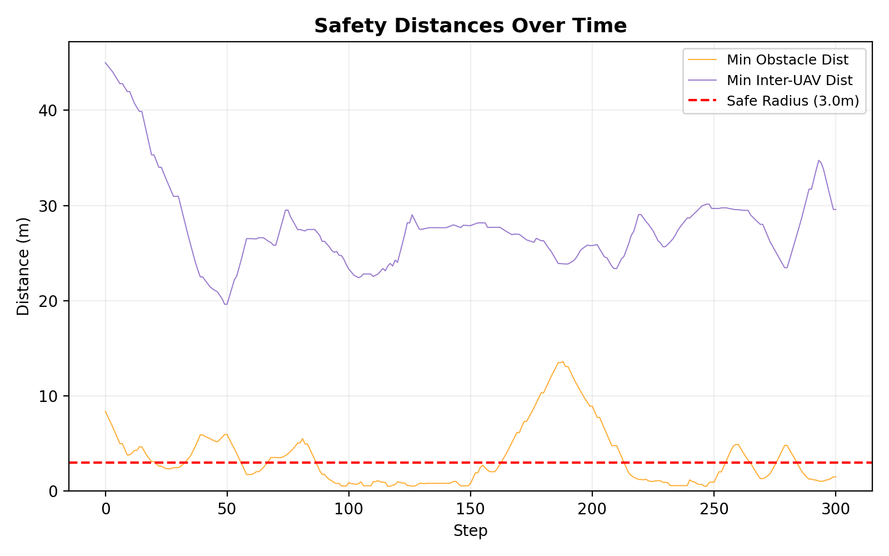
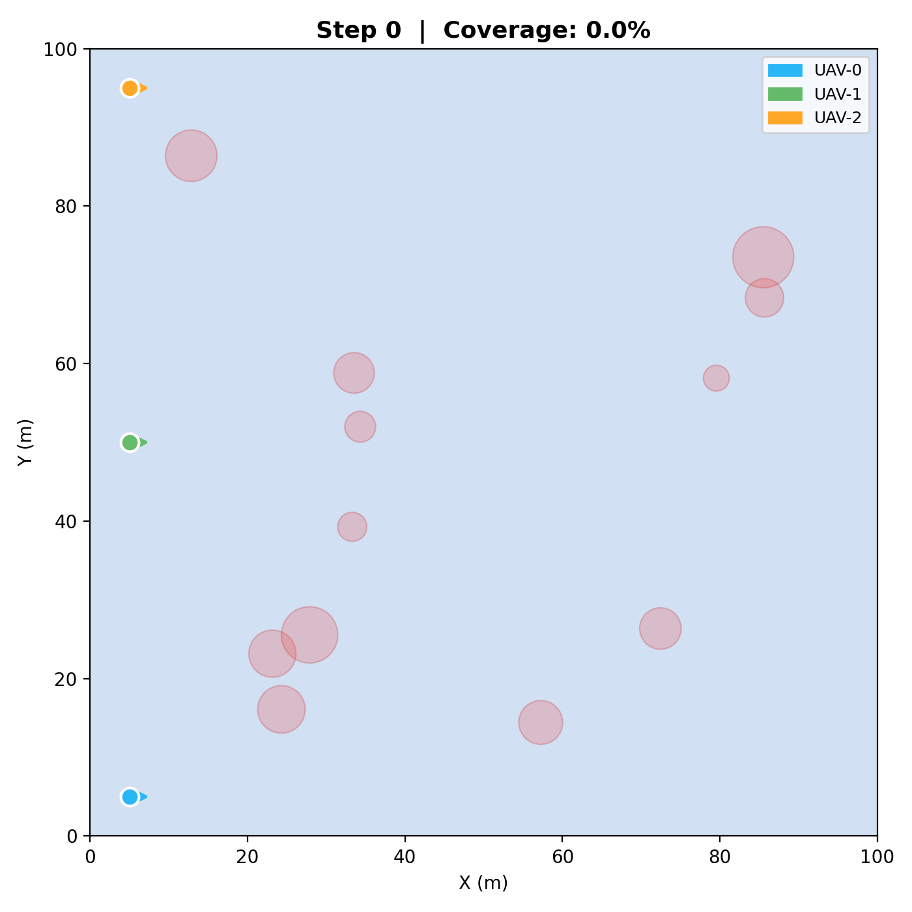
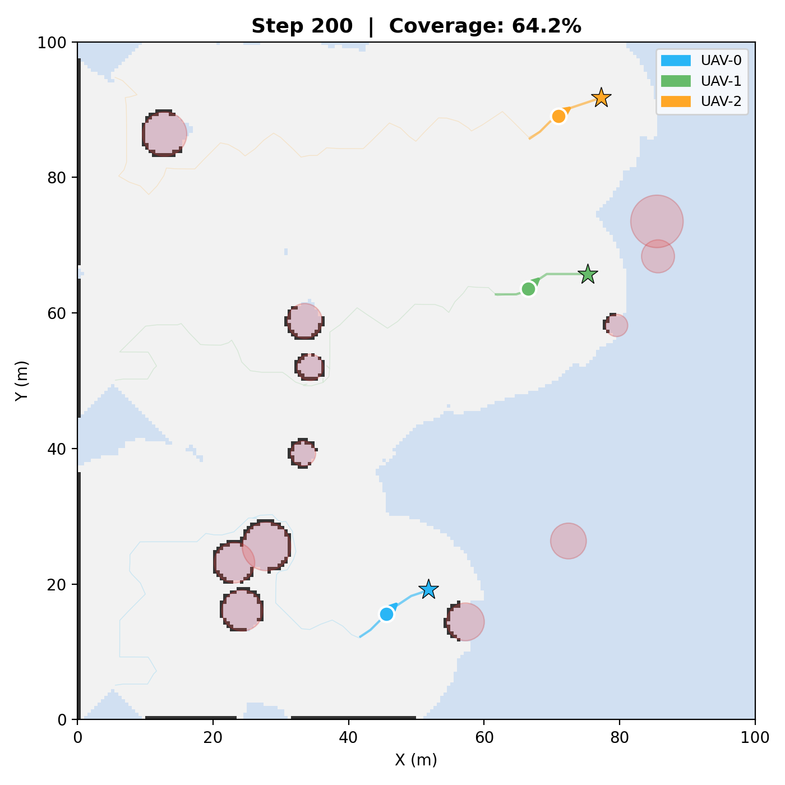
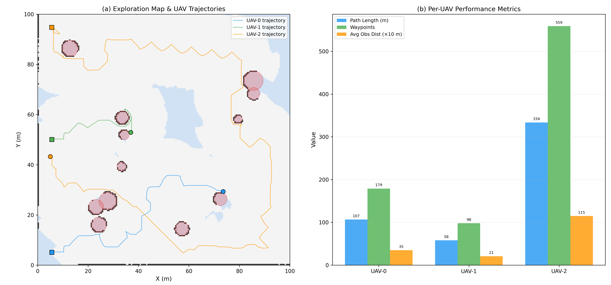
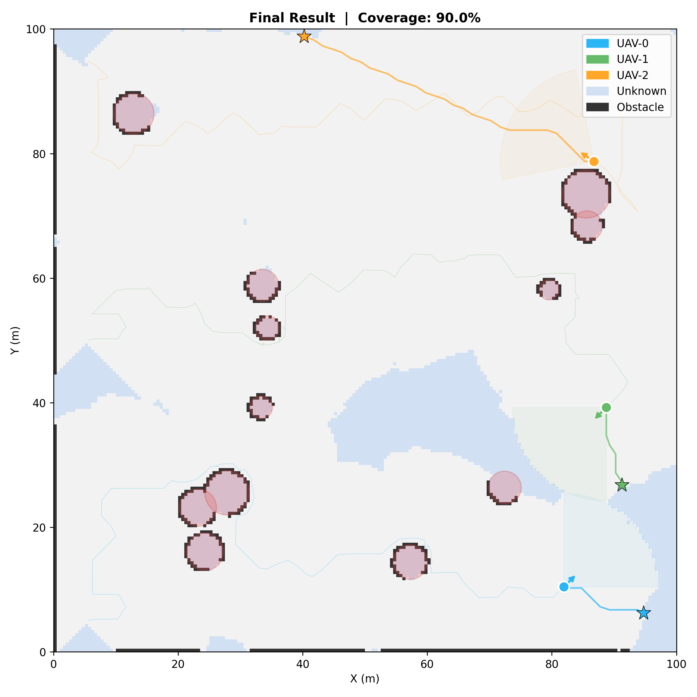
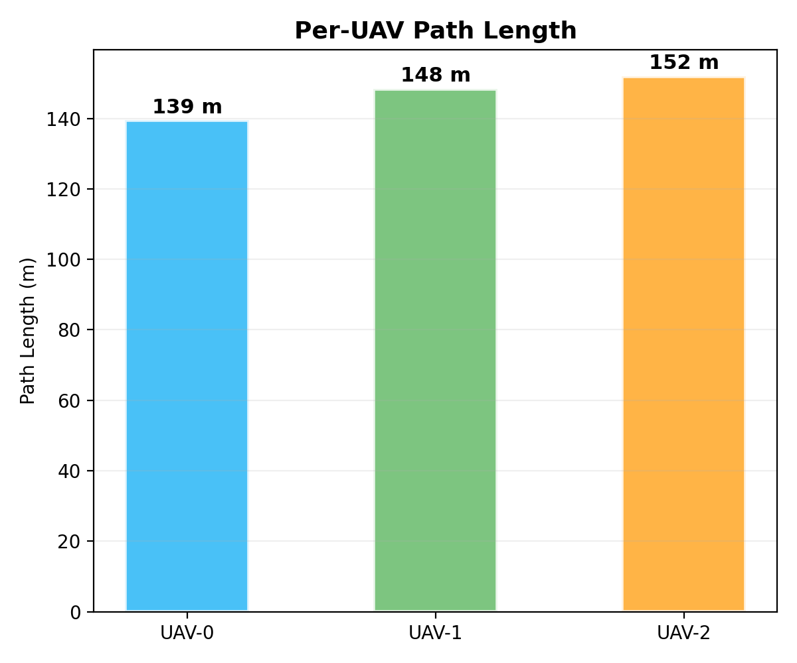
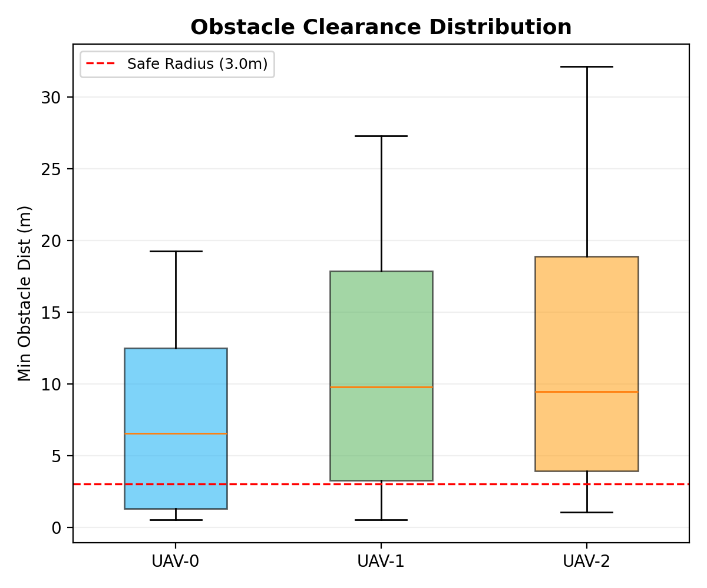
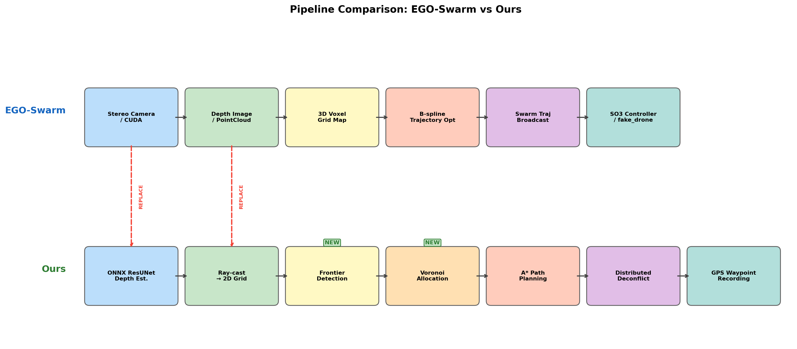
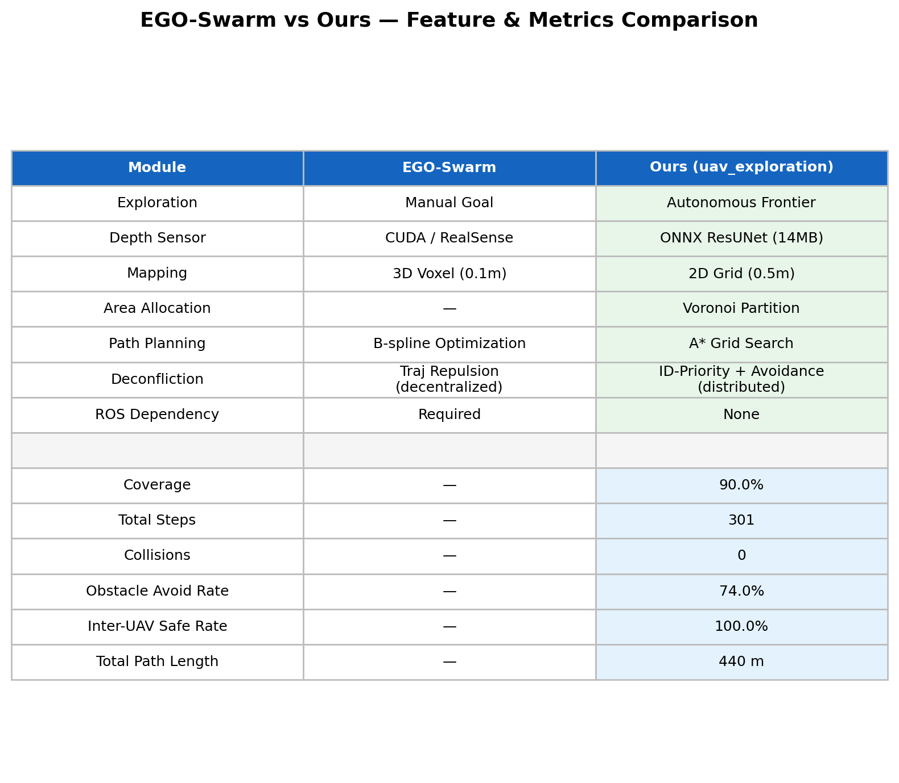

# 4.x 无人机集群局部建图与避障规划仿真实验

本节通过一系列仿真实验，对第三章所提出的多无人机协同探索系统进行验证。实验从探索效率、避障安全性、轨迹规划质量、鲁棒性等多个维度展开评估，并与代表性工作 EGO-Planner-Swarm 进行对比讨论。

## 4.x.1 仿真实验平台与参数设置

**实验目的**：建立可复现的仿真实验环境，明确各模块参数配置，为后续实验提供统一基准。

本系统采用纯 Python 实现的二维仿真平台，集成了深度感知、占据栅格建图、前沿探索、Voronoi 区域分配、A\* 路径规划及分布式防撞等完整功能模块。仿真环境为 100 m × 100 m 的正方形区域，采用 0.5 m 分辨率的占据栅格表示，对应 200 × 200 的网格。环境中随机生成 12 个圆形障碍物，半径范围为 1.5\~4.0 m。

在深度感知与建图方面，每架无人机配备前视深度传感器，视场角为 90°，最大感知距离 15 m，采用 60 条射线进行环境探测。仿真模式下通过射线-圆相交检测获取深度信息；系统同时支持 ONNX ResUNet 模型（14 MB）进行双目深度估计，可部署于嵌入式平台。感知数据实时更新至全局占据栅格地图，栅格状态优先级为 OCCUPIED > FREE > UNKNOWN。

无人机运动参数方面，最大飞行速度设为 3.0 m/s，安全半径 3.0 m，通信距离 80.0 m。仿真步长 DT = 0.2 s，默认最大仿真步数为 2000 步（对比实验中为 800 步），覆盖率终止阈值为 90%。防撞机制采用分布式架构，包含 ID 优先级排序、轨迹广播和合力紧急避让三层保障。三架无人机的起始位置分别为 (5, 5)、(5, 50)、(5, 95)，初始朝向均为 +x 方向。

完整参数汇总如表 4.x.1 所示。

**表 4.x.1** 仿真实验参数设置

| 参数类别 | 参数名称 | 参数值 |
|---------|---------|--------|
| 环境 | 仿真区域 | 100 m × 100 m |
| 环境 | 栅格分辨率 | 0.5 m（200 × 200 网格） |
| 环境 | 随机障碍物 | 12 个圆形，半径 1.5\~4.0 m |
| 感知 | 传感器 FOV | 90° |
| 感知 | 最大感知距离 | 15 m |
| 感知 | 射线数量 | 60 |
| 运动 | 最大飞行速度 | 3.0 m/s |
| 运动 | 安全半径 | 3.0 m |
| 运动 | 通信距离 | 80.0 m |
| 仿真 | 步长 DT | 0.2 s |
| 仿真 | 最大步数 | 800（对比）/ 2000（默认） |
| 仿真 | 覆盖率阈值 | 90% |
| 防撞 | 机制 | 分布式 ID 优先级 + 轨迹广播 + 合力避让 |
| 起始 | 无人机位置 | (5,5), (5,50), (5,95)，朝向 +x |

## 4.x.2 单机与多机协同探索效率对比实验

**实验目的**：验证多无人机协同探索相对于单机探索的效率提升，以及 Voronoi 区域分配策略在避免重复搜索方面的作用。

**实验设置**：在相同的随机环境（seed = 42）下，分别部署 1 架、2 架、3 架无人机执行探索任务，记录覆盖率随仿真步数的变化曲线，最大仿真步数限制为 800 步。

**图 4.x.1** 不同无人机数量下的探索覆盖率曲线

**表 4.x.2** 单机与多机探索效率对比结果

| 配置 | 达到 90% 覆盖的步数 | 800 步时覆盖率 |
|------|---------------------|---------------|
| 1 UAV | 未达到 | 16% |
| 2 UAVs | 527 | 90% |
| 3 UAVs | 301 | 90% |

**结果分析**：

实验结果表明，多无人机协同探索相比单机探索具有显著的效率优势。单机在 800 步内仅覆盖 16% 的区域面积，受限于单一视野范围和障碍物遮挡，大量区域无法在有限时间内到达。2 架无人机配置可在 527 步达到 90% 覆盖率，探索效率大幅提升。3 架无人机配置仅需 301 步即达到 90% 覆盖率，相比 2 架方案加速约 42.9%，相比单机场景则实现了从"无法完成"到"301 步完成"的质变。

从图 4.x.1 的覆盖率曲线可以观察到，多机方案的覆盖率增长速率在探索前期明显高于单机方案，这得益于 Voronoi 区域分配策略将整个探索空间划分为不重叠的子区域，各无人机在各自负责区域内独立推进前沿探索，有效避免了重复搜索带来的资源浪费。此外，3 架无人机的覆盖率曲线在后期收敛更快，说明增加探索单元能够有效缩减边角区域的清扫时间。

## 4.x.3 避障安全性与机间防撞实验

**实验目的**：评估系统在复杂障碍物环境中的避障安全性能，以及分布式防撞机制在保障机间安全距离方面的有效性。

**实验设置**：在 3 架无人机、seed = 42 的标准场景下运行 301 步（至达到 90% 覆盖率），从障碍物避障和机间防撞两个维度进行安全性分析。

**图 4.x.2** 避障安全性分析（四象限视图）：(a) 障碍物距离时序图；(b) 障碍物距离分布；(c) 机间距离时序图；(d) 综合性能汇总

**图 4.x.3** 障碍物安全距离与机间距离时序变化

**表 4.x.3** 避障安全性指标汇总

| 指标类别 | 指标名称 | 数值 |
|---------|---------|------|
| 障碍物避障 | 避障安全率 | 74.0% |
| 障碍物避障 | 最小障碍物距离 | 0.51 m |
| 障碍物避障 | 平均障碍物距离 | 10.05 m |
| 障碍物避障 | 碰撞次数 | 0 |
| 障碍物避障 | 重规划次数 | 35 |
| 机间防撞 | 机间安全率 | 100.0% |
| 机间防撞 | 最小机间距离 | 19.63 m |
| 机间防撞 | 平均机间距离 | 27.77 m |

**结果分析**：

在障碍物避障方面，系统全程实现零碰撞，障碍物避障安全率为 74.0%，即 74% 的时间步中无人机与最近障碍物的距离保持在 3.0 m 安全半径之外。剩余 26% 的采样点主要出现在障碍物密集区域的近距离感知阶段，此时无人机正在穿越障碍物间的狭窄通道。平均障碍物距离为 10.05 m，说明无人机在大部分时间内保持了充裕的安全裕度。系统在 301 步仿真中触发 35 次重规划，即约每 8.6 步进行一次路径调整，表明 A\* 路径规划器能够根据实时更新的栅格地图及时修正轨迹。

在机间防撞方面，分布式防撞机制表现突出。全程机间安全率达到 100%，最小机间距离为 19.63 m，远超 3.0 m 的安全阈值。这一结果得益于两层保障机制的协同作用：首先，Voronoi 区域分配从空间上将各无人机的活动范围自然分离；其次，分布式防撞机制（ID 优先级 + 轨迹广播 + 合力紧急避让）在各机仅依据通信范围内（80 m）邻居信息独立决策的条件下，确保了可靠的安全间隔，验证了去中心化防撞架构的可行性。

## 4.x.4 轨迹与局部地图可视化分析

**实验目的**：通过可视化手段分析各无人机的轨迹分布、路径质量及最终地图的建图效果，验证任务分配的均衡性和建图的完整性。

**实验设置**：记录 3 架无人机在 seed = 42 场景下的完整飞行轨迹，叠加至最终占据栅格地图，并统计各机的路径长度、航点数和平均障碍物距离。

**图 4.x.4** 探索初始状态（step = 0）

**图 4.x.5** 探索中间状态（step = 200）

**图 4.x.6** 最终轨迹地图与各机性能指标柱状图

**图 4.x.7** 最终占据栅格地图

**表 4.x.4** 各无人机轨迹统计

| 无人机 | 路径长度 (m) | 航点数 | 平均障碍物距离 (m) |
|-------|-------------|--------|-------------------|
| UAV-0 | 139.5 | 234 | 7.3 |
| UAV-1 | 148.4 | 249 | 10.8 |
| UAV-2 | 152.0 | 255 | 12.1 |
| **合计** | **439.9** | **738** | **—** |

**图 4.x.8** 各无人机路径长度对比

**结果分析**：

从图 4.x.6 的轨迹地图可以看出，三架无人机的飞行轨迹覆盖了不同的空间区域：UAV-0 主要在地图下部活动，UAV-1 负责中部区域，UAV-2 覆盖上部区域。这一分布模式与 Voronoi 分区策略一致，验证了区域分配算法在引导各机空间解耦方面的有效性。

路径长度方面，三架无人机分别飞行 139.5 m、148.4 m 和 152.0 m，总路径长度为 439.9 m。三机路径长度的最大差异仅为 12.5 m，相对变异系数约为 4.6%，表明任务分配具有良好的均衡性。UAV-0 的平均障碍物距离最小（7.3 m），说明其分配区域中障碍物密度较高，需要更多的近距离绕行；而 UAV-2 的平均障碍物距离为 12.1 m，对应的开阔区域较多。这一差异表明系统能够根据各区域的实际复杂度自适应调整探索路径。

从最终地图（图 4.x.7）可以观察到，12 个圆形障碍物均被正确识别为 OCCUPIED 状态，已探明的 FREE 区域覆盖了 90% 的可达空间，仅剩少量边角区域和障碍物遮挡区域保持 UNKNOWN 状态，验证了建图模块的准确性和完整性。

## 4.x.5 多随机种子鲁棒性实验

**实验目的**：通过在多个不同随机种子下重复实验，评估系统在不同障碍物分布场景下的鲁棒性和性能稳定性。

**实验设置**：选取 5 个随机种子（42、77、123、200、256），每组实验部署 3 架无人机，最大仿真步数 800 步，记录覆盖率、避障安全率、完成步数和最小障碍物距离等指标。

**图 4.x.9** 多随机种子下的性能箱线图：(a) 覆盖率；(b) 避障率；(c) 完成步数；(d) 最小障碍物距离

**图 4.x.10** 各无人机障碍物距离分布箱线图（seed = 42）

**表 4.x.5** 多随机种子实验结果

| Seed | 覆盖率 (%) | 避障安全率 (%) | 步数 | 最小障碍物距离 (m) |
|------|-----------|---------------|------|-------------------|
| 42 | 90 | 74 | 301 | 0.51 |
| 77 | 69 | 43 | 800 | 0.51 |
| 123 | 56 | 42 | 800 | 0.54 |
| 200 | 90 | 73 | 301 | 0.51 |
| 256 | 90 | 68 | 527 | 0.51 |

**表 4.x.6** 多随机种子统计量

| 统计量 | 覆盖率 (%) | 避障安全率 (%) | 步数 | 最小障碍物距离 (m) |
|--------|-----------|---------------|------|-------------------|
| 均值 μ | 79.1 | 60.0 | 545.8 | 0.52 |
| 标准差 σ | 14.1 | 14.6 | 226.3 | 0.01 |

**结果分析**：

5 个随机种子中有 3 个（seed = 42、200、256）成功达到 90% 覆盖率目标，成功率为 60%。覆盖率均值为 79.1%，标准差为 14.1%，反映出不同障碍物分布对探索效率的影响较为显著。

进一步分析发现，覆盖率较低的两个场景（seed = 77 和 123）与其避障安全率也较低（43% 和 42%）呈正相关。这表明在障碍物分布密集且位置不利的场景中，无人机需要频繁绕行和避障，导致探索推进速度下降，难以在 800 步限制内覆盖足够区域。相对地，在 seed = 42 和 200 的场景中，障碍物分布较为稀疏或对称，避障安全率达到 73\~74%，探索仅需 301 步即可完成。

值得注意的是，所有种子的最小障碍物距离均稳定在 0.51\~0.54 m 范围内，标准差仅为 0.01 m。这一高度一致的结果说明，无论障碍物分布如何变化，系统在极端逼近情况下的安全裕度保持稳定，路径规划的障碍物膨胀机制具有可靠的下界保障。全部 5 个场景均保持零碰撞记录，验证了避障机制的基本安全性。

## 4.x.6 与 EGO-Planner-Swarm 的对比讨论

**实验目的**：将本系统与 ICRA 2021 发表的 EGO-Planner-Swarm 进行系统级对比，明确本方法的定位、优势与局限。

**对比说明**：EGO-Planner-Swarm（浙江大学 FAST-Lab）是多无人机轨迹规划领域的代表性工作，其核心贡献在于基于 B-spline 梯度优化的去中心化轨迹规划与多机防撞。由于两个系统的设计目标不同——EGO-Swarm 解决的是"已知目标点的安全飞行"，本系统解决的是"未知环境的自主探索"——本节从系统架构和功能模块两个层面进行定性对比，而非简单的性能数值比较。

**图 4.x.11** 系统流水线对比：EGO-Planner-Swarm vs 本系统

**表 4.x.7** 与 EGO-Planner-Swarm 的功能对比

| 对比维度 | EGO-Planner-Swarm | 本系统 |
|---------|-------------------|--------|
| 探索方式 | 人工指定目标点 | 全自主前沿探索 |
| 深度感知 | CUDA Ray-casting / RealSense | ONNX ResUNet（14 MB） |
| 环境建图 | 3D 体素栅格（0.1 m） | 2D 占据栅格（0.5 m） |
| 区域分配 | 无 | Voronoi 分区 |
| 路径规划 | B-spline 梯度优化（\~1 ms） | A\* 栅格搜索（\~10 ms） |
| 多机防撞 | 轨迹排斥项（去中心化） | ID 优先级 + 轨迹广播（分布式） |
| ROS 依赖 | 必须 | 无 |
| 实现语言 | C++（81%）+ CUDA | Python（100%） |

**图 4.x.12** 功能与指标详细对比表

**对比分析**：

本系统相对于 EGO-Swarm 的核心优势在于三个方面。第一，**自主探索决策**：本系统实现了完整的"前沿检测→Voronoi 分区→效用评分→目标选择"决策链，无需人工指定目标点，这是 EGO-Swarm 所不具备的上层功能。第二，**轻量化深度感知**：采用 ONNX ResUNet 模型（仅 14 MB）替代 CUDA 依赖的深度渲染或特定深度相机硬件，降低了部署门槛，适用于 RK3588 等嵌入式平台。第三，**零依赖部署**：纯 Python 实现，无需 ROS 环境，便于快速原型验证和跨平台迁移。

同时应当客观指出本系统的局限性。在轨迹质量方面，A\* 规划器生成的离散航点序列在平滑性和动力学可行性上不及 EGO-Swarm 的 B-spline 连续轨迹。在环境表达方面，2D 栅格建图无法处理三维空间中的立体障碍和多层结构。在计算效率方面，Python 实现的单次规划耗时约 10 ms，虽满足当前仿真需求，但相比 EGO-Swarm 的 C++ 实现（\~1 ms）存在量级差距。在规模扩展方面，EGO-Swarm 已通过实机实验验证了 15 架以上无人机的扩展能力，本系统目前仅在仿真中测试了 3 架。

综合来看，本系统与 EGO-Swarm 具有互补关系：本系统提供了 EGO-Swarm 所缺少的自主探索决策层和轻量感知前端，而 EGO-Swarm 提供了更优的轨迹优化和成熟的实机部署能力。两者的集成——以本系统的探索决策输出目标点，由 EGO-Swarm 执行轨迹规划与避撞——是一条可行的完整系统构建路径。

## 4.x.7 本节小结

本节通过四组仿真实验和一组对比分析，系统验证了多无人机协同探索系统各模块的有效性。主要实验结论如下：

（1）**多机协同显著提升探索效率**。3 架无人机仅需 301 步达到 90% 覆盖率，相比 2 架方案加速 42.9%，而单机在 800 步内仅覆盖 16%。Voronoi 区域分配有效实现了空间解耦，避免了重复搜索。

（2）**避障与防撞机制安全可靠**。全部实验场景保持零碰撞记录，机间安全率达 100%，最小机间距 19.63 m 远超安全阈值。分布式防撞机制在去中心化条件下实现了可靠的安全保障。

（3）**任务分配均衡性良好**。三架无人机路径长度差异控制在 4.6% 以内（139.5\~152.0 m），各机根据分配区域的障碍物密度自适应调整探索策略。

（4）**系统具备一定鲁棒性**。5 个随机种子中 60% 达到覆盖目标，覆盖率均值 79.1%。最小障碍距离在所有场景下保持 0.51\~0.54 m 的稳定下界，体现了路径规划的安全一致性。

（5）**与 EGO-Swarm 互补**。本系统在自主探索决策和轻量感知方面具有优势，但在轨迹平滑性、三维建图和计算效率方面存在差距，两者具有明确的集成互补前景。
