# 实验1：UAV 数量与速度参数变化

## 实验概述

本实验系统评估无人机数量和最大飞行速度对协同探索性能的影响。通过 3×3 参数网格（n_drones × max_speed）和 10 个随机种子，共计 90 次仿真运行，分析各参数组合下的覆盖率、效率和安全性。

### 实验参数

| 参数 | 值 |
|------|------|
| UAV 数量 | 1, 2, 3 |
| 最大速度 | 1.5, 3.0, 4.5 m/s |
| 最大步数 | 800 |
| 覆盖率阈值 | 90% |
| 随机种子 | 42, 77, 123, 200, 256, 314, 512, 666, 777, 999 |
| 总运行次数 | 90（3×3×10） |

---

## 图1：覆盖率随步数变化（3×3 子图）

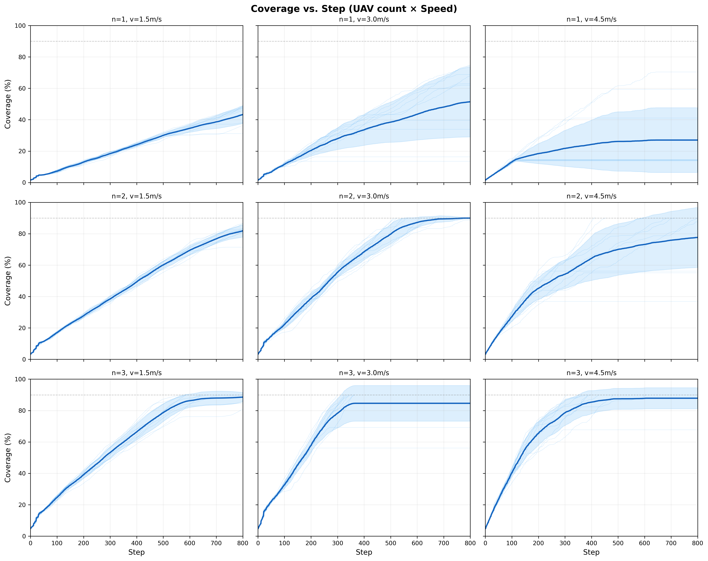

9 个子图组成 3×3 矩阵，行为 UAV 数量（n=1/2/3），列为最大速度（v=1.5/3.0/4.5 m/s）。每幅子图中细线为各种子的覆盖率曲线，粗线为均值，阴影为 ±1 标准差，灰色虚线为 90% 阈值。

### 逐行分析

**n=1（单机）**
- 所有速度组合均无法在 800 步内达到 90%，覆盖率在 27%~51% 间
- v=3.0 表现最优（51.4%），v=4.5 反而最差（27.0%）
- 单机探索效率严重受限于空间大小，100×100m 地图对单机来说过大

**n=2（双机）**
- v=3.0 成功率最高（90%），9/10 种子达到 90% 覆盖率
- v=1.5 速度过慢，800 步不够走完全图（成功率 0%）
- v=4.5 成功率 50%，高速导致路径规划频繁失败

**n=3（三机）**
- v=4.5 成功率最高（90%），3 机+高速组合探索效率最优
- v=3.0 成功率 80%，与实验 2/6 的标准配置一致
- v=1.5 成功率 70%，低速但多机仍可在部分场景达标

### 逐列分析

**v=1.5 m/s**
- 速度过慢，仅 n=3 有 70% 成功率
- 覆盖率随机数增长明显：n=1(43%) → n=2(82%) → n=3(89%)

**v=3.0 m/s**
- 最均衡的速度选择
- n=2 和 n=3 均有高成功率（90%、80%）

**v=4.5 m/s**
- 单机时反而表现最差（27%），因高速下路径规划困难
- 多机时表现良好，n=3 v=4.5 达到 90% 成功率

---

## 图2：探索过程快照（seed=42）

各参数组合在 seed=42 下的探索过程快照，展示 step=0/50/100/200/300/301 时刻的地图状态。

### 单机快照
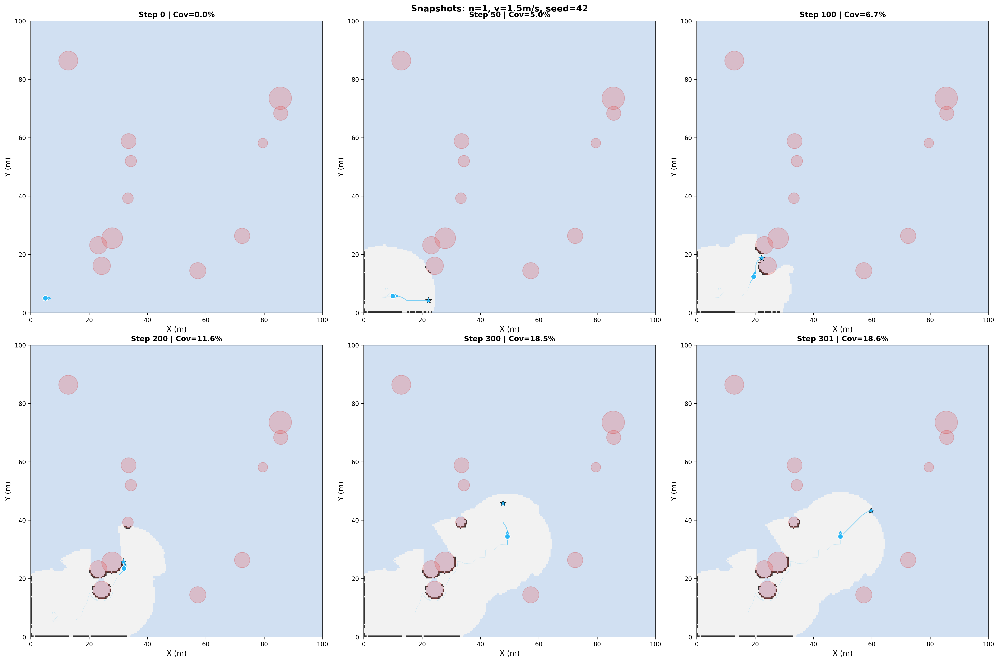
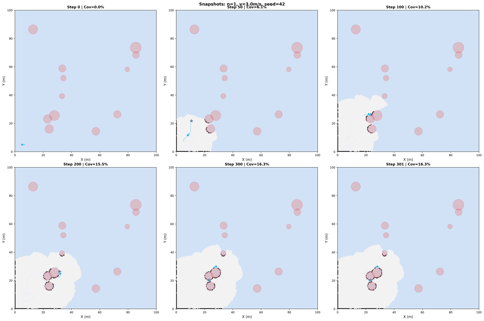
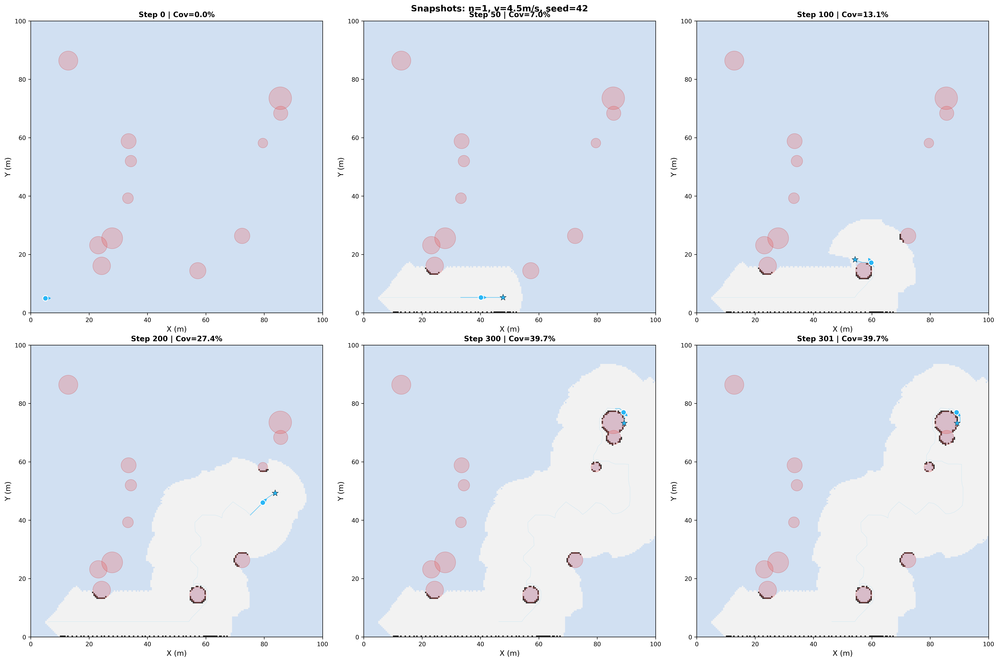

### 双机快照
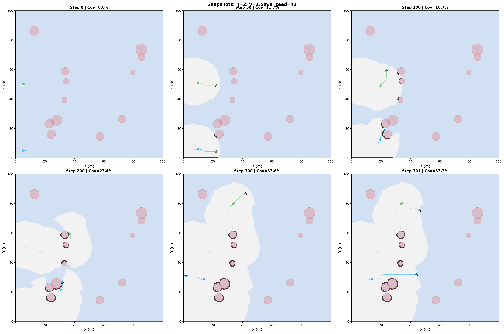
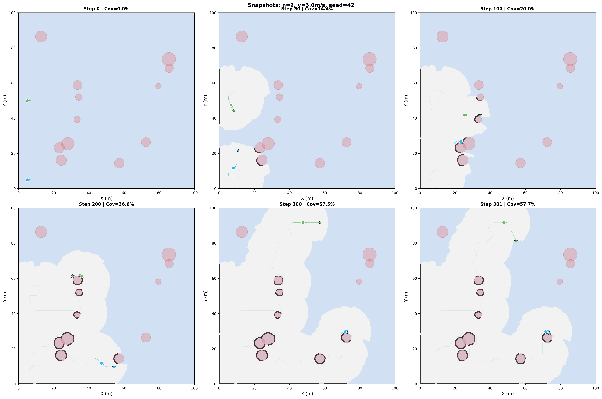
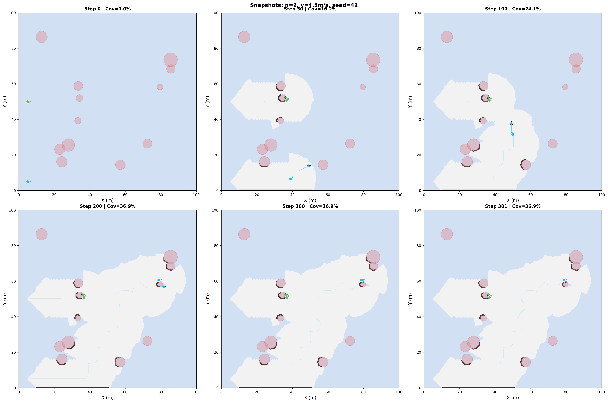

### 三机快照
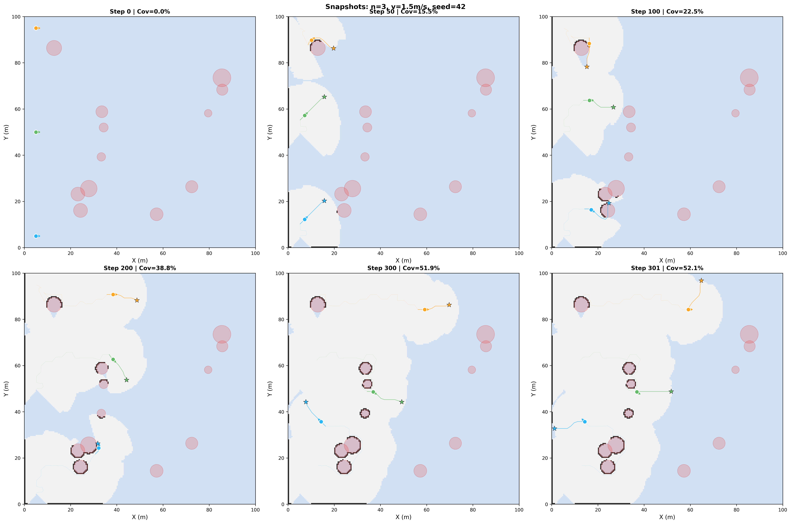
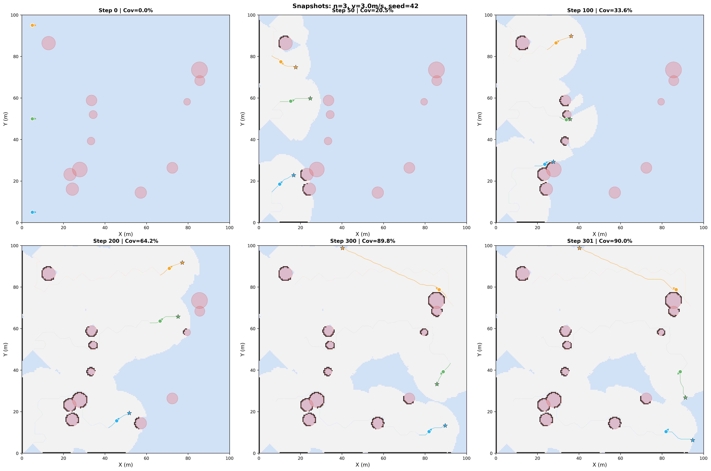
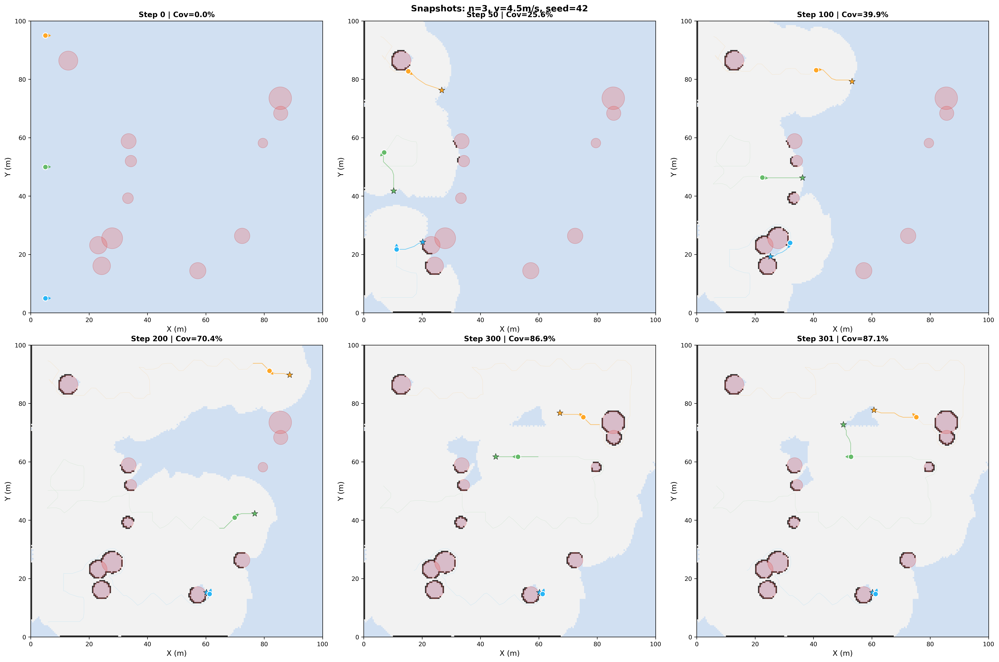

**关键观察：**
- 单机在 300 步时仅覆盖地图约 1/3~1/2
- 双机在 step=200 附近已覆盖约 60%~70%，协同效果显著
- 三机在 step=300 时基本完成探索（>85%），多机优势明显
- 高速（v=4.5）下 UAV 移动步幅更大，单步覆盖更多区域

---

## 图3：各 UAV 路径长度柱状图

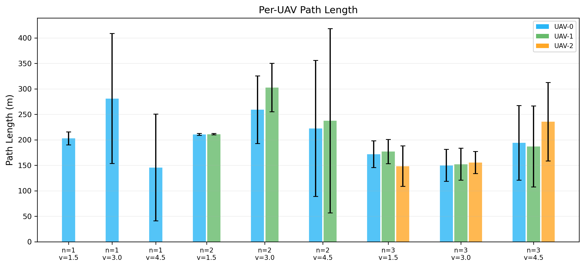

分组柱状图展示 9 种参数组合下各 UAV 的平均路径长度。不同颜色代表不同 UAV（UAV-0/1/2）。

**关键观察：**
- 单机路径较短（146~281m），因为只有一架 UAV 且无法充分探索
- 双机的单机路径约 200-280m，总路径 421~562m
- 三机下 Voronoi 分区使各机路径均衡（路径差异小），负载均衡 CV < 0.1
- v=4.5+n=3 时路径最长（616m），高速多机组合探索最充分

---

## 图4：指标汇总表

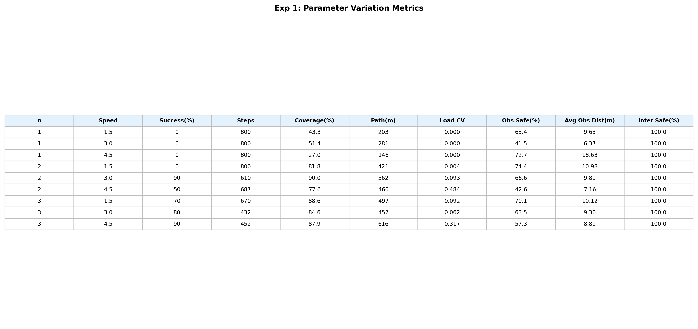

| n | Speed | Success(%) | Steps | Coverage(%) | Path(m) | Load CV | Obs Safe(%) | Avg Obs Dist(m) | Inter Safe(%) |
|---|-------|------------|-------|-------------|---------|---------|-------------|-----------------|--------------|
| 1 | 1.5 | 0 | 800 | 43.3 | 203 | 0.000 | 65.4 | 9.63 | 100.0 |
| 1 | 3.0 | 0 | 800 | 51.4 | 281 | 0.000 | 41.5 | 6.37 | 100.0 |
| 1 | 4.5 | 0 | 800 | 27.0 | 146 | 0.000 | 72.7 | 18.63 | 100.0 |
| 2 | 1.5 | 0 | 800 | 81.8 | 421 | 0.004 | 74.4 | 10.98 | 100.0 |
| 2 | 3.0 | 90 | 610 | 90.0 | 562 | 0.093 | 66.6 | 9.89 | 100.0 |
| 2 | 4.5 | 50 | 687 | 77.6 | 460 | 0.484 | 42.6 | 7.16 | 100.0 |
| 3 | 1.5 | 70 | 670 | 88.6 | 497 | 0.092 | 70.1 | 10.12 | 100.0 |
| 3 | 3.0 | 80 | 432 | 84.6 | 457 | 0.062 | 63.5 | 9.30 | 100.0 |
| 3 | 4.5 | 90 | 452 | 87.9 | 616 | 0.317 | 57.3 | 8.89 | 100.0 |

### 指标解读

- **Success(%)**：10 个种子中成功达到 90% 覆盖率的比例
- **Steps**：平均达到 90% 覆盖率所需步数（未达标按 800 计）
- **Coverage(%)**：最终覆盖率均值
- **Path(m)**：所有 UAV 总路径长度均值
- **Load CV**：各 UAV 路径长度的变异系数，越小表示负载越均衡
- **Obs Safe(%)**：到最近障碍距离 > 安全半径的步数比例
- **Avg Obs Dist(m)**：UAV 到最近障碍物的平均距离（越大越安全）
- **Inter Safe(%)**：机间距 > 安全半径的步数比例

---

## 结论

1. **UAV 数量是决定性因素**：单机在 800 步内无法达到 90% 覆盖率（任何速度），双机在最优速度下达到 90% 成功率，三机在所有速度下均有 70%+ 成功率

2. **速度并非越快越好**：v=4.5 在单机时表现最差（27%），因高速导致路径规划成功率下降。最优速度取决于机数：单机 v=3.0 最优，多机 v=4.5 最优

3. **最佳配置为 n=3, v=4.5**：成功率 90%，平均 452 步完成，是效率最高的组合

4. **负载均衡**：三机 v=3.0 的 Load CV=0.062（最均衡），v=4.5 的 CV=0.317 较高，说明高速下部分 UAV 路径规划失败导致负载不均

5. **机间安全率 100%**：所有 90 次运行中机间安全率均为 100%，验证了分布式防撞机制在各种参数下的有效性

6. **障碍物安全率随速度下降**：v=4.5 的 Obs Safe 普遍低于 v=1.5（57% vs 70%），因高速移动步幅大，UAV 更易接近障碍物

7. **多机协同的边际效益**：n=1→2 的提升（+40% 覆盖率）远大于 n=2→3 的提升（+7%），说明在当前场景规模下 2-3 架 UAV 已接近饱和
