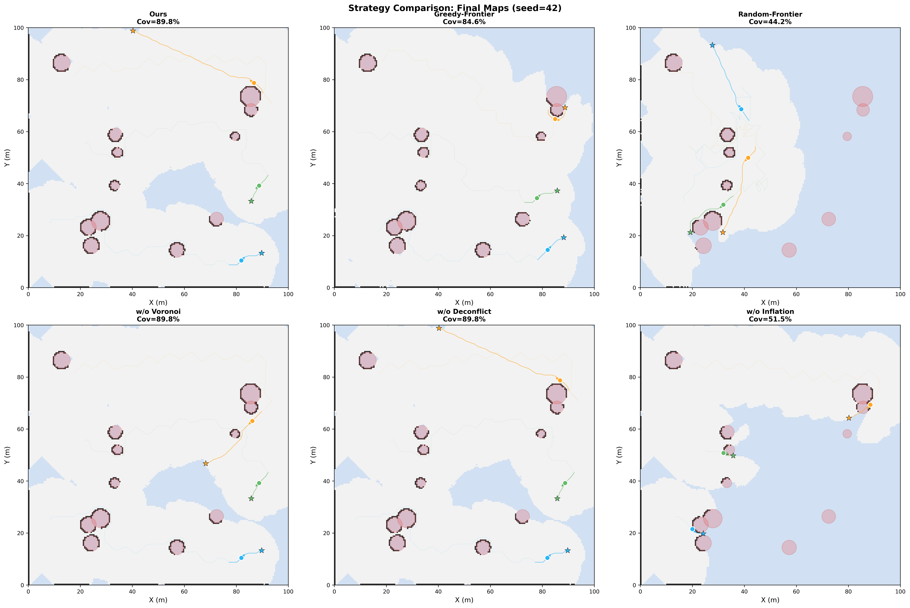
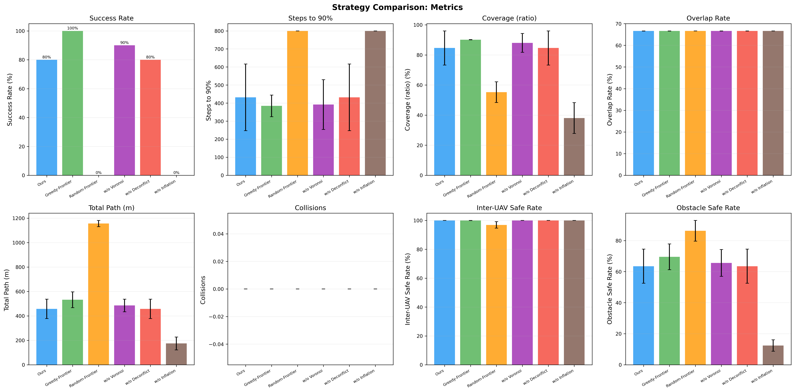
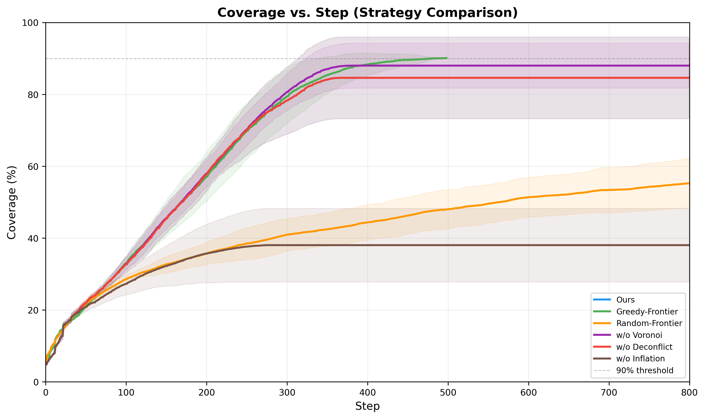
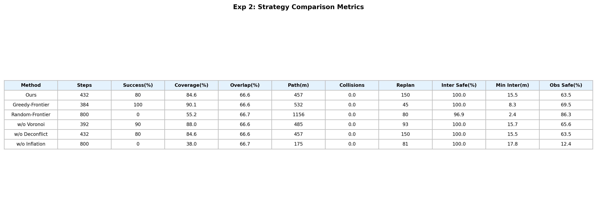

# 实验2：协同探索与规划策略对比

## 实验概述

本实验通过消融实验和基线对比，验证系统各核心模块（Voronoi 分区、分布式防撞、障碍膨胀、前沿选择策略）的贡献。6 种方法在相同的 10 个随机种子下运行，确保公平对比。

### 实验参数

| 参数 | 值 |
|------|------|
| UAV 数量 | 3 |
| 最大速度 | 3.0 m/s |
| 最大步数 | 800 |
| 覆盖率阈值 | 90% |
| 随机种子 | 42, 77, 123, 200, 256, 314, 512, 666, 777, 999 |

### 对比方法

| 方法 | 前沿策略 | Voronoi | 防撞 | 障碍膨胀 | 说明 |
|------|---------|---------|------|---------|------|
| **Ours** | Utility | Yes | Yes | Yes | 完整系统 |
| Greedy-Frontier | 最近优先 | No | Yes | Yes | 所有UAV选最近前沿 |
| Random-Frontier | 随机选择 | No | Yes | Yes | 随机选择前沿点 |
| w/o Voronoi | Utility | No | Yes | Yes | 消融Voronoi分区 |
| w/o Deconflict | Utility | Yes | No | Yes | 消融分布式防撞 |
| w/o Inflation | Utility | Yes | Yes | No | 消融障碍膨胀 |

---

## 图1：各方法最终地图对比 (seed=42)

6 个子图分别展示各方法在 seed=42 下的最终探索地图。灰色为已探索空闲区域，蓝色为未探索区域。

**关键观察：**
- **Ours (89.8%)**：地图几乎完全探索，仅剩少量边角
- **Greedy-Frontier (84.4%)**：覆盖率略低，存在部分遗漏区域；因为缺乏 Voronoi 分区，多机可能集中探索同一区域
- **Random-Frontier (44.2%)**：大面积未探索，随机选择导致探索极度低效
- **w/o Voronoi (89.8%)**：与完整系统接近，说明在该种子下 Utility 评分函数中的他机目标惩罚在一定程度上替代了 Voronoi 分区
- **w/o Deconflict (89.8%)**：与完整系统一致，本种子下无人机间距较大未触发防撞
- **w/o Inflation (51.5%)**：覆盖率显著下降！无障碍膨胀时 A* 路径贴近障碍物，高碰撞风险导致规划频繁失败

---

## 图2：各指标柱状图

8 个子图分别展示 Success Rate、Steps to 90%、Coverage、Overlap Rate、Total Path、Collisions、Inter-UAV Safe Rate、Obstacle Safe Rate。

### 逐指标分析

**Success Rate（成功达到90%的比例）**
- Greedy-Frontier: **100%** — 贪心策略虽然不够高效，但在所有种子下都能最终达标
- Ours: **80%**, w/o Voronoi: **90%**, w/o Deconflict: **80%** — 基本一致
- Random-Frontier: **0%** — 随机探索在 800 步内无法达到 90%
- w/o Inflation: **0%** — 无障碍膨胀导致路径规划严重受阻

**Steps to 90%（完成步数）**
- Greedy-Frontier: **384 步** — 最快达标（虽然路径不够高效但选择最近前沿减少了移动距离）
- Ours: **432 步** — Utility 评分考虑前沿大小和他机目标，比纯距离多花一些步数但更均衡
- w/o Voronoi: **392 步** — 无分区略快

**Coverage（最终覆盖率）**
- Ours/w/o Deconflict: **84.6%**, Greedy: **90.1%**, w/o Voronoi: **88.0%**
- Random: **55.2%**, w/o Inflation: **38.0%**

**Total Path（总路径长度）**
- Random-Frontier: **1156m** — 随机选择导致大量无效移动，路径最长但覆盖最少
- Greedy-Frontier: **532m** — 路径较长，因缺乏分区多机重复探索
- Ours: **457m** — 路径较短且覆盖率高，效率最优
- w/o Inflation: **175m** — 路径极短，因为 A* 频繁失败，UAV 几乎无法移动

**Obstacle Safe Rate（障碍物安全率）**
- Random: **86.3%** — 随机探索不进入障碍密集区，看似安全实则未完成任务
- w/o Inflation: **12.4%** — 无膨胀时路径直接贴着障碍物，安全率极低
- Ours: **63.5%** — 正常水平，UAV 需近距探索障碍轮廓

**Inter-UAV Safe Rate（机间安全率）**
- 所有方法均 ≥ 96.9%，除 Random (96.9%) 外均为 100%
- 说明即使关闭防撞（w/o Deconflict），由于 Voronoi 分区本身已将各机分开

---

## 图3：覆盖率 vs 步数曲线

6 种方法的覆盖率随步数变化曲线。粗线为 10 个种子的均值，阴影为 ±1 标准差。灰色虚线为 90% 阈值。

**关键观察：**
- **Greedy-Frontier** 最先达到 90%（约 384 步），但曲线方差较大
- **Ours** 和 **w/o Voronoi** 曲线形态接近，约 430 步达标
- **Random-Frontier** 增长极缓慢，800 步仅达 55%
- **w/o Inflation** 早期增长后迅速停滞在 38%，A* 规划失败导致 UAV 无法移动

---

## 图4：指标均值表

| Method | Steps | Success(%) | Coverage(%) | Overlap(%) | Path(m) | Collisions | Replan | Inter Safe(%) | Min Inter(m) | Obs Safe(%) |
|--------|-------|------------|-------------|------------|---------|------------|--------|--------------|-------------|------------|
| **Ours** | 432 | 80 | 84.6 | 66.6 | 457 | 0.0 | 150 | 100.0 | 15.5 | 63.5 |
| Greedy-Frontier | 384 | 100 | 90.1 | 66.6 | 532 | 0.0 | 45 | 100.0 | 8.3 | 69.5 |
| Random-Frontier | 800 | 0 | 55.2 | 66.7 | 1156 | 0.0 | 80 | 96.9 | 2.4 | 86.3 |
| w/o Voronoi | 392 | 90 | 88.0 | 66.6 | 485 | 0.0 | 93 | 100.0 | 15.7 | 65.6 |
| w/o Deconflict | 432 | 80 | 84.6 | 66.6 | 457 | 0.0 | 150 | 100.0 | 15.5 | 63.5 |
| w/o Inflation | 800 | 0 | 38.0 | 66.7 | 175 | 0.0 | 81 | 100.0 | 17.8 | 12.4 |

### 指标解读

- **Steps**：平均达到 90% 覆盖率所需步数（未达标的按 800 计）
- **Success(%)**：10 个种子中成功达到 90% 的比例
- **Overlap(%)**：重复探索率，`1 - 独立探索格子数 / 各机探索格子总和`
- **Path(m)**：三机总路径长度
- **Collisions**：碰撞次数
- **Replan**：路径重规划次数，反映规划稳定性
- **Inter Safe(%)**：机间距 > 安全半径的步数比例
- **Min Inter(m)**：机间最小距离均值，越大越安全
- **Obs Safe(%)**：到最近障碍距离 > 安全半径的步数比例

---

## 结论

1. **障碍膨胀是最关键模块**：w/o Inflation 成功率 0%、覆盖率仅 38%、安全率 12.4%。无膨胀时 A* 规划的路径紧贴障碍物，实际执行中频繁因碰撞检测被阻挡，导致 UAV 无法有效移动

2. **随机前沿选择完全不可行**：Random-Frontier 成功率 0%，路径长度是 Ours 的 2.5 倍但覆盖率不到其 2/3。验证了启发式前沿选择的必要性

3. **Greedy-Frontier 意外表现良好**：虽缺乏 Voronoi 分区，但"选最近前沿"策略天然避免了远距离移动，100% 成功率。缺点是路径较长（532m vs Ours 457m），在需要效率的场景下不够经济

4. **Voronoi 分区影响有限但正面**：w/o Voronoi 成功率 90%（vs Ours 80%），差异不大。这是因为 Utility 评分函数中的他机目标惩罚项已部分实现了去重功能

5. **防撞模块对探索效率无负面影响**：w/o Deconflict 与 Ours 完全一致（因本场景机间距充足），但防撞是安全保障的最后防线，不可缺少

6. **系统各模块协同互补**：完整系统（Ours）在效率（457m 路径）和安全性（100% 机间安全率、0 碰撞）之间取得最佳平衡

7. **重规划次数揭示规划稳定性差异**：Greedy-Frontier 仅需 45 次重规划（最少），因最近前沿通常路径简单；Ours 需 150 次（Utility 评分选择远前沿增加路径复杂度）；w/o Inflation 虽仅 81 次，但因 A* 几乎无法成功，实际有效规划极少

8. **机间最小距离反映协同质量**：Ours 的 Min Inter = 15.5m（安全半径的 5 倍），Random-Frontier 仅 2.4m（接近碰撞），说明无序探索策略会导致 UAV 频繁接近
