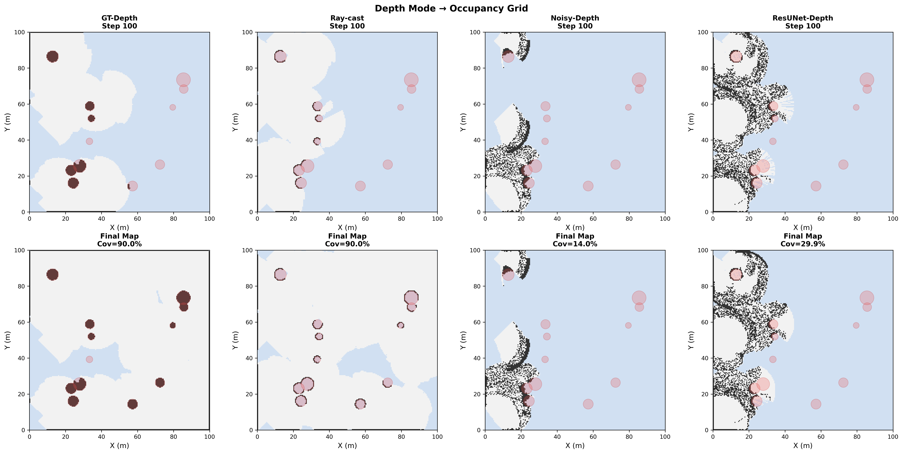
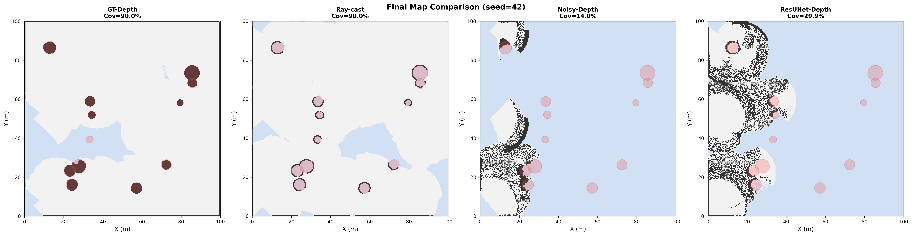
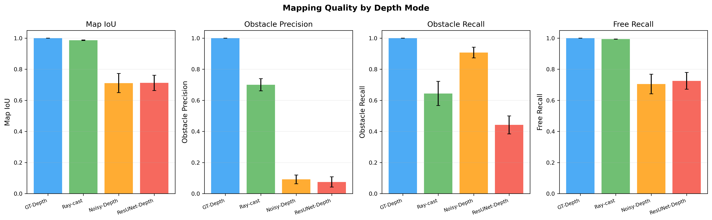
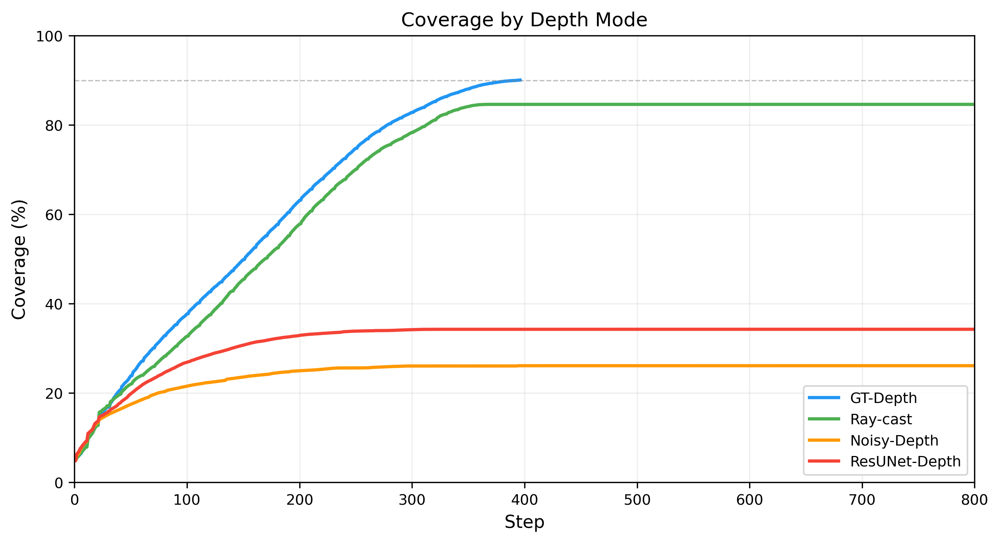
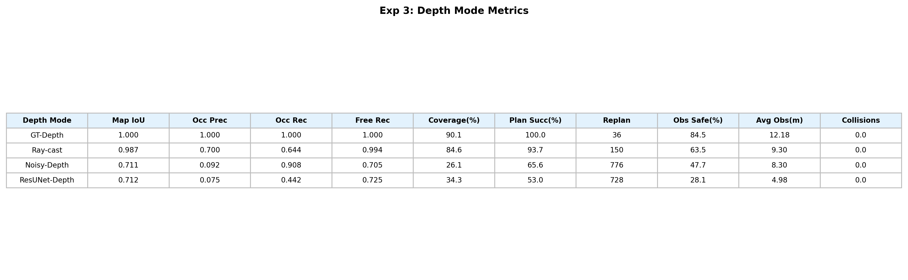

# 实验3：深度输入模式对建图质量的影响

## 实验概述

本实验评估不同深度感知模式对栅格地图构建质量和探索效率的影响。4 种深度模式模拟了从理想到真实的梯度，用于量化深度精度对下游建图、路径规划和覆盖率的影响。每种模式在 10 个随机种子下运行。

### 实验参数

| 参数 | 值 |
|------|------|
| UAV 数量 | 3 |
| 最大速度 | 3.0 m/s |
| 最大步数 | 800 |
| 覆盖率阈值 | 90% |
| 随机种子 | 42, 77, 123, 200, 256, 314, 512, 666, 777, 999 |

### 深度模式说明

| 模式 | 方法 | 说明 |
|------|------|------|
| **GT-Depth** | 直接写入真值 | 在传感器范围内直接将地面真值占据状态写入栅格地图，无任何误差 |
| **Ray-cast** | 光线投射 | 系统默认模式，沿传感器方向发射射线并根据命中结果更新栅格 |
| **Noisy-Depth** | 带噪声射线 | 在 Ray-cast 基础上对深度值添加高斯噪声 (σ=0.5m)，模拟深度传感器测量误差 |
| **ResUNet-Depth** | 结构化误差 | 模拟 ResUNet 深度估计的典型误差模式：系统偏差 + 结构化噪声 + 随机异常值 |

---

## 图1：深度模式栅格对比 (seed=42)

四个子图分别展示各深度模式下 seed=42 的最终栅格地图。灰色为已探索空闲区域，深灰/黑色为占据区域，蓝色为未探索区域。

**关键观察：**
- **GT-Depth**：地图完整清晰，障碍物边界精确，无任何噪声
- **Ray-cast**：接近 GT-Depth，偶尔在障碍物边缘有微小偏差
- **Noisy-Depth**：地图出现明显噪声，障碍物边界模糊扩散，大量区域被错误标记为占据
- **ResUNet-Depth**：与 Noisy-Depth 类似的噪声特征，但误差分布不均匀，存在结构化伪影

---

## 图2：最终地图对比

展示各深度模式下最终探索地图的覆盖情况。

**关键观察：**
- GT-Depth 和 Ray-cast 的覆盖区域广阔，大部分空间已被探索
- Noisy-Depth 和 ResUNet-Depth 的覆盖区域显著缩小，大面积区域仍为未探索状态
- 深度噪声导致虚假障碍物被写入地图，A* 路径规划被阻塞，UAV 无法前进

---

## 图3：建图质量指标柱状图

4 个子图分别展示 Map IoU、Occupied Precision、Occupied Recall、Free Recall 指标。

### 逐指标分析

**Map IoU（地图交并比）**
- GT-Depth: **1.000** — 完美复现地面真值
- Ray-cast: **0.987** — 接近完美，极小的离散化误差
- Noisy-Depth: **0.711** — 显著下降，噪声破坏了地图结构
- ResUNet-Depth: **0.712** — 与 Noisy-Depth 接近

**Occupied Precision（占据精度）**
- GT-Depth: **1.000**, Ray-cast: **0.700** — 射线投射会将部分空闲格子误判为占据
- Noisy-Depth: **0.092** — 极低！大量空闲区域被噪声标记为占据（假阳性严重）
- ResUNet-Depth: **0.075** — 最低，结构化误差产生更多虚假占据

**Occupied Recall（占据召回率）**
- GT-Depth: **1.000** — 所有障碍物均被正确检测
- Noisy-Depth: **0.908** — 虽然精度极低，但真实障碍物大部分被检测到
- Ray-cast: **0.644** — 部分障碍物因射线角度问题未被检测
- ResUNet-Depth: **0.442** — 结构化误差导致部分真实障碍物被遗漏

**Free Recall（空闲召回率）**
- GT-Depth: **1.000**, Ray-cast: **0.994** — 空闲区域识别准确
- Noisy-Depth: **0.705** — 约 30% 的空闲区域被错误标记为占据
- ResUNet-Depth: **0.725** — 与 Noisy-Depth 接近

---

## 图4：覆盖率随步数变化曲线

各深度模式的平均覆盖率随仿真步数的变化趋势。

**关键观察：**
- **GT-Depth** 和 **Ray-cast** 覆盖率稳步上升，分别在约 350 步和 400+ 步附近达到 90%
- **Noisy-Depth** 覆盖率增长缓慢，最终仅达到约 26%，因为大量虚假障碍物阻塞了路径规划
- **ResUNet-Depth** 略优于 Noisy-Depth，最终约 34%，但同样因深度误差导致路径规划成功率低
- GT-Depth 与 Ray-cast 之间的差距主要在探索后期（边角区域），前期差异不大

---

## 图5：指标汇总表

| Depth Mode | Map IoU | Occ Prec | Occ Rec | Free Rec | Coverage(%) | Plan Succ(%) | Replan | Obs Safe(%) | Avg Obs(m) | Collisions |
|------------|---------|----------|---------|----------|-------------|-------------|--------|-------------|-----------|------------|
| **GT-Depth** | 1.000 | 1.000 | 1.000 | 1.000 | 90.1 | 100.0 | 36 | 84.5 | 12.18 | 0.0 |
| **Ray-cast** | 0.987 | 0.700 | 0.644 | 0.994 | 84.6 | 93.7 | 150 | 63.5 | 9.30 | 0.0 |
| **Noisy-Depth** | 0.711 | 0.092 | 0.908 | 0.705 | 26.1 | 65.6 | 776 | 47.7 | 8.30 | 0.0 |
| **ResUNet-Depth** | 0.712 | 0.075 | 0.442 | 0.725 | 34.3 | 53.0 | 728 | 28.1 | 4.98 | 0.0 |

### 指标解读

- **Map IoU**：构建地图与地面真值的交并比，衡量整体建图准确性
- **Occ Prec（占据精度）**：被标记为占据的格子中实际为障碍物的比例。低精度意味着大量假阳性（空闲区域被误判为障碍）
- **Occ Rec（占据召回率）**：真实障碍物中被正确标记的比例。低召回意味着障碍物被遗漏
- **Free Rec（空闲召回率）**：真实空闲区域中被正确标记的比例。低值意味着可通行区域被错误封堵
- **Coverage(%)**：最终探索覆盖率
- **Plan Succ(%)**：A* 路径规划的成功率。低成功率意味着虚假障碍阻断了大量路径
- **Replan**：重规划次数。高重规划次数反映路径频繁失败后的重试
- **Obs Safe(%)**：UAV 到最近障碍物距离 > 安全半径的步数比例。深度误差越大，安全率越低
- **Avg Obs(m)**：UAV 到最近障碍物的平均距离。GT-Depth 下距离最大（12.18m），说明准确建图使路径规划能有效远离障碍

---

## 结论

1. **GT-Depth 是理想上限**：Map IoU = 1.0，覆盖率 90.1%，规划成功率 100%，仅需 36 次规划即可完成探索。证明了系统在完美感知下的最优性能

2. **Ray-cast 模式表现优异**：IoU = 0.987、覆盖率 84.6%、规划成功率 93.7%。作为系统默认模式，仅有轻微的离散化误差，是可靠的感知基线

3. **深度噪声对建图质量影响严重**：Noisy-Depth 和 ResUNet-Depth 的 Occ Precision 仅约 8%，意味着超过 90% 的"占据"标记是错误的。这些虚假障碍物直接堵塞了 A* 路径，导致规划成功率骤降（53%~66%）

4. **建图质量是覆盖率的瓶颈**：GT-Depth → 90.1% vs Noisy-Depth → 26.1%，覆盖率差距 3.5 倍。深度精度通过"虚假障碍 → 路径阻断 → 探索停滞"的链条级联放大

5. **重规划次数反映系统压力**：GT-Depth 仅 36 次重规划，而 Noisy-Depth 达 776 次（21.6 倍），说明低质量深度给规划模块带来了巨大压力

6. **高占据召回 ≠ 高建图质量**：Noisy-Depth 的 Occ Recall = 0.908（高），但 Occ Precision = 0.092（极低），说明噪声倾向于将一切标记为占据——召回高是因为"什么都标"，而非真正检测到了障碍物
