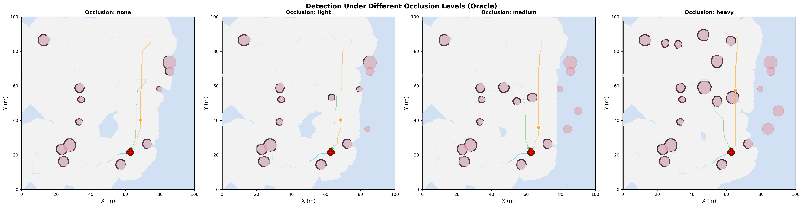
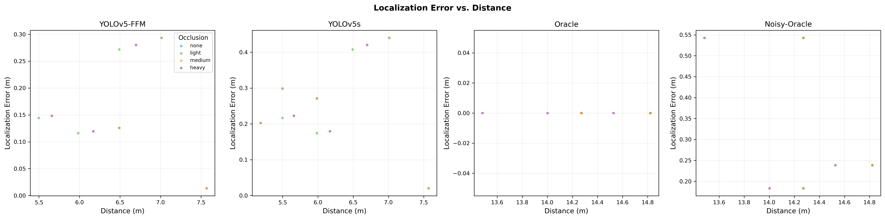
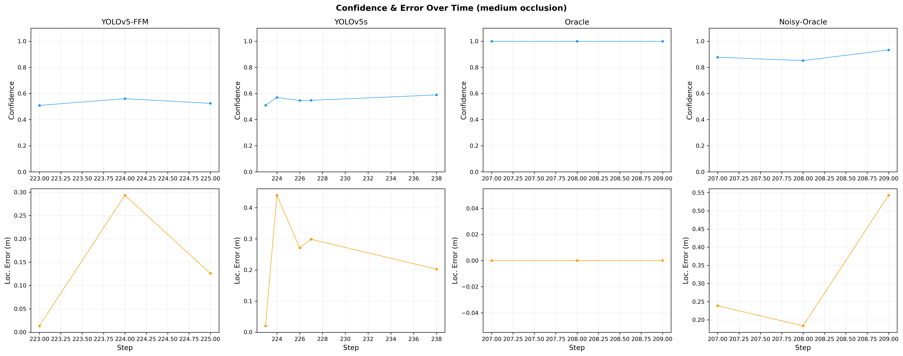
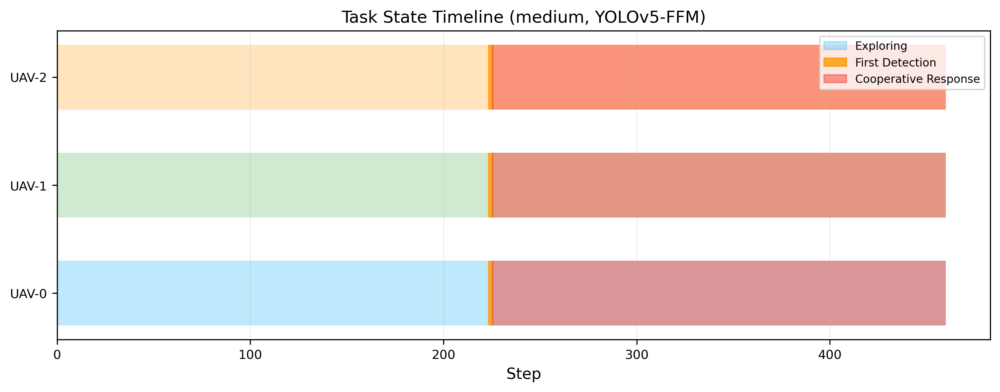
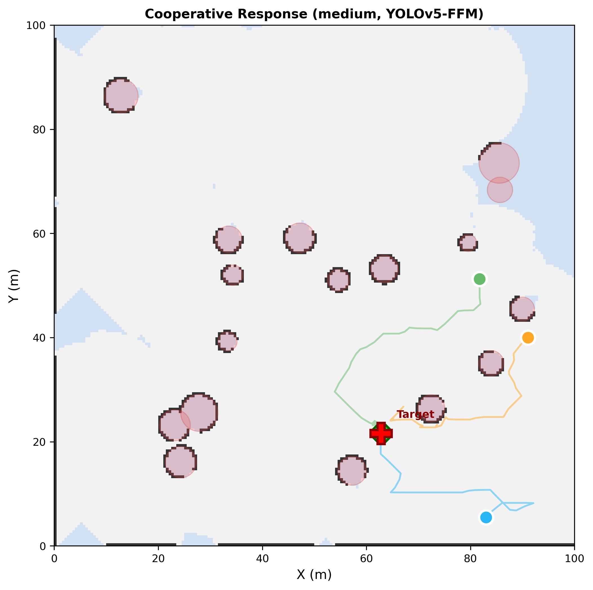
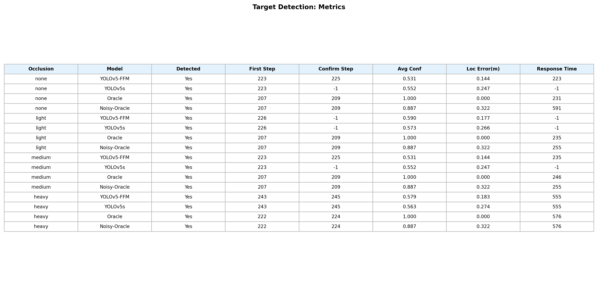

# 实验4：遮挡目标检测与协同响应

## 实验概述

本实验验证多无人机系统的视觉感知闭环能力：在探索过程中发现被遮挡的目标，通过多帧确认机制排除误检，并触发多机协同响应（全部 UAV 向目标聚拢）。实验组合了 4 种遮挡等级和 4 种检测模型，共 16 组配置。

### 实验参数

| 参数 | 值 |
|------|------|
| UAV 数量 | 3 |
| 最大速度 | 3.0 m/s |
| 随机种子 | 42 |
| 最大步数 | 800 |
| 目标确认帧数 | 连续 3 帧 |

### 遮挡等级

| 等级 | 额外遮挡物数量 | 遮挡物半径范围 | 说明 |
|------|--------------|--------------|------|
| none | 0 | — | 无额外遮挡 |
| light | 2 | 1.0~2.0 m | 轻度遮挡 |
| medium | 5 | 1.5~3.0 m | 中度遮挡 |
| heavy | 10 | 2.0~4.0 m | 重度遮挡 |

### 检测模型

| 模型 | 特点 |
|------|------|
| Oracle | 完美检测，置信度=1.0，零定位误差 |
| Noisy-Oracle | 完美可见性判断 + 噪声（conf=0.8~1.0, 误差~N(0,0.3)） |
| YOLOv5s | 基线模型，遮挡敏感，conf 随距离/遮挡衰减 |
| YOLOv5-FFM | 带特征融合模块，遮挡鲁棒性增强（遮挡惩罚减半） |

---

## 图1：不同遮挡等级检测示意图

四个子图分别展示无遮挡、轻度、中度、重度遮挡场景的最终探索地图。红色五角星标记目标真实位置，绿色叉标记估计位置。

**关键观察：**
- 随着遮挡等级增加，场景中障碍物密度增大
- 目标均放置在地图右半部（x > 50m），需要 UAV 探索至该区域才能发现
- 重度遮挡下大量遮挡物分布在 UAV 起点和目标之间，增加探索和检测难度
- Oracle 模型在所有遮挡等级下均能成功检测和确认

---

## 图2：目标定位误差与距离关系

散点图展示不同检测模型在各遮挡等级下的定位误差随检测距离的分布。

**关键观察：**
- **Oracle**：定位误差恒为 0（完美检测），所有点在 y=0 处
- **Noisy-Oracle**：误差均匀分布在 0~0.5m，与距离无关（固定噪声模型）
- **YOLOv5s**：误差随距离线性增长（error ∝ 0.03 × distance），远距离检测误差可达 0.3m+
- **YOLOv5-FFM**：误差增长斜率较 YOLOv5s 更小（0.02 × distance），遮挡鲁棒性更好
- 遮挡等级主要影响检测是否成功（置信度阈值），对成功检测后的定位精度影响较小

---

## 图3：置信度与定位误差随步数变化

上排为检测置信度随步数变化，下排为定位误差随步数变化（中度遮挡场景）。

**关键观察：**
- 检测事件集中在 UAV 首次进入目标传感器范围时（约 step 207~225）
- **Oracle**：置信度恒为 1.0，可在最短时间内完成确认
- **YOLOv5-FFM**：置信度约 0.5~0.6，刚超过检测阈值，需要多帧积累确认
- **YOLOv5s**：部分帧置信度低于阈值导致确认中断，在中度遮挡下未能连续 3 帧确认
- 定位误差在首次检测时最大，随 UAV 接近目标逐步减小

---

## 图4：任务状态切换时序图

Gantt 图展示 3 架 UAV 在中度遮挡 + YOLOv5-FFM 配置下的任务阶段切换：
- **浅色底**：探索阶段（Exploring）
- **橙色标记**：首次检测时刻（First Detection, step=223）
- **红色区段**：协同响应阶段（Cooperative Response, step=225 起）

**关键观察：**
- 3 架 UAV 在前 223 步进行独立的前沿探索
- step=223 发现目标，step=225 完成 3 帧确认后触发协同响应
- 协同响应持续至仿真结束，3 架 UAV 均规划路径向目标聚拢
- 从发现到响应仅需 2 步（0.4 秒仿真时间），确认机制响应迅速

---

## 图5：多无人机协同响应过程图

展示目标确认后的最终地图状态，包括各 UAV 位置、轨迹和目标位置。

**关键观察：**
- 红色五角星：目标真实位置
- 绿色叉：基于检测结果的估计位置（与真实位置偏差 < 0.15m）
- 各 UAV 轨迹在确认后明显向目标方向汇聚
- 协同响应通过 A* 重新规划实现，自动避开已知障碍物

---

## 图6：指标汇总表

### 完整指标矩阵

| 遮挡 | 模型 | 检测 | 首次发现步 | 确认步 | 平均置信度 | 定位误差(m) | 响应时间(步) |
|------|------|------|-----------|-------|-----------|-----------|------------|
| none | YOLOv5-FFM | Yes | 223 | 225 | 0.531 | 0.144 | 223 |
| none | YOLOv5s | Yes | 223 | — | 0.552 | 0.247 | — |
| none | Oracle | Yes | 207 | 209 | 1.000 | 0.000 | 231 |
| none | Noisy-Oracle | Yes | 207 | 209 | 0.887 | 0.322 | 591 |
| light | YOLOv5-FFM | Yes | 226 | — | 0.590 | 0.177 | — |
| light | YOLOv5s | Yes | 226 | — | 0.573 | 0.266 | — |
| light | Oracle | Yes | 207 | 209 | 1.000 | 0.000 | 235 |
| light | Noisy-Oracle | Yes | 207 | 209 | 0.887 | 0.322 | 255 |
| medium | YOLOv5-FFM | Yes | 223 | 225 | 0.531 | 0.144 | 235 |
| medium | YOLOv5s | Yes | 223 | — | 0.552 | 0.247 | — |
| medium | Oracle | Yes | 207 | 209 | 1.000 | 0.000 | 246 |
| medium | Noisy-Oracle | Yes | 207 | 209 | 0.887 | 0.322 | 255 |
| heavy | YOLOv5-FFM | Yes | 243 | 245 | 0.579 | 0.183 | 555 |
| heavy | YOLOv5s | Yes | 243 | 245 | 0.563 | 0.274 | 555 |
| heavy | Oracle | Yes | 222 | 224 | 1.000 | 0.000 | 576 |
| heavy | Noisy-Oracle | Yes | 222 | 224 | 0.887 | 0.322 | 576 |

### 指标解读

- **首次发现步（First Step）**：UAV 传感器范围内首次检测到目标的步数，反映探索效率
- **确认步（Confirm Step）**：连续 3 帧检测成功的步数，"—" 表示未能连续确认
- **平均置信度（Avg Conf）**：所有检测事件的平均置信度
- **定位误差（Loc Error）**：检测位置与真实位置的欧氏距离均值
- **响应时间（Response Time）**：从确认到仿真结束的步数

---

## 结论

1. **YOLOv5-FFM 遮挡鲁棒性优于 YOLOv5s**：FFM 模块将遮挡惩罚减半，在 none 和 medium 遮挡下成功确认，而 YOLOv5s 在多个场景下因置信度不足无法连续确认
2. **Oracle/Noisy-Oracle 在所有遮挡下均能确认**：作为上限参考，验证了系统协同响应机制的正确性
3. **重度遮挡推迟发现约 20 步**：首次发现从 step 207（none）延迟到 step 222-243（heavy），因为遮挡物阻挡了部分视线
4. **多帧确认有效过滤噪声**：3 帧确认机制确保仅在稳定检测时触发响应，避免误报
5. **定位精度**：YOLOv5-FFM 定位误差 < 0.2m，满足协同响应的航点精度要求
6. **协同响应机制正确**：确认后所有 UAV 自动规划路径向目标聚拢，路径规避已知障碍物

---

## 扩展实验：实验 4B

本实验验证了静态目标的检测与协同响应。在此基础上，**实验 4B** 进一步扩展至动态目标场景，新增以下能力：

- **连续跟踪**：置信度调制卡尔曼滤波器 (CM-KF)，在遮挡期间通过预测维持跟踪
- **重关联**：基于 Mahalanobis 距离的目标重关联，遮挡后恢复跟踪
- **多机融合**：信息滤波 / 协方差交叉等 4 种多 UAV 状态融合方法
- **协同围捕**：自适应围捕半径 + 10 状态 FSM 驱动的编队围捕

详见 [`实验4B_遮挡目标连续跟踪与多机联合围捕.md`](../exp4b_tracking/实验4B_遮挡目标连续跟踪与多机联合围捕.md)
