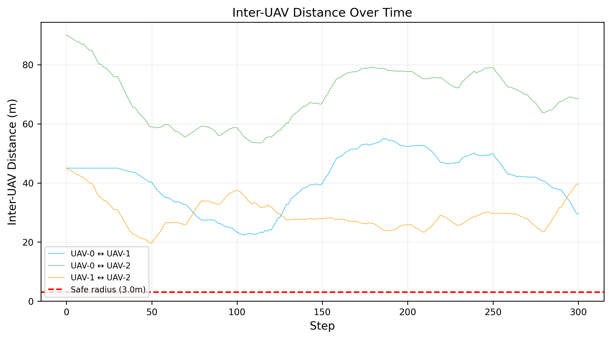
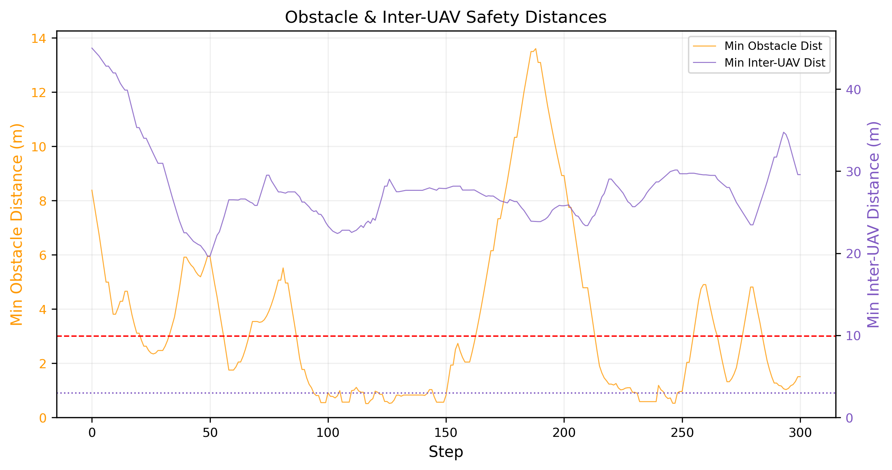
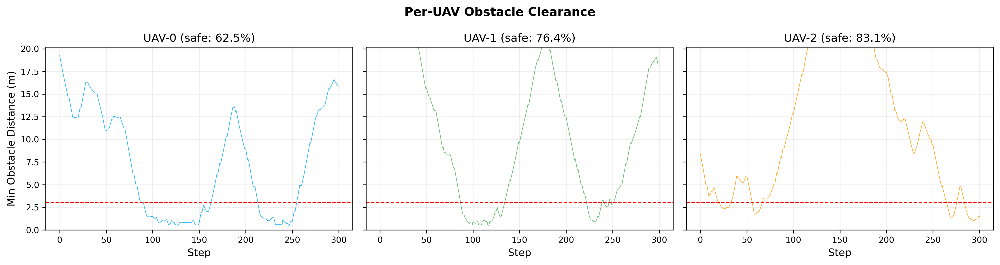
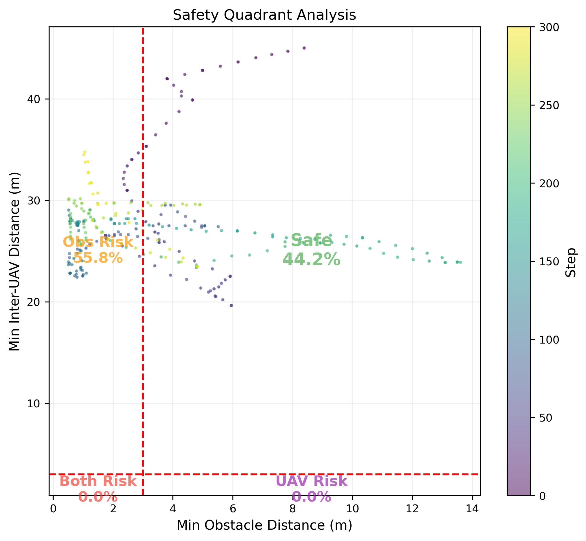
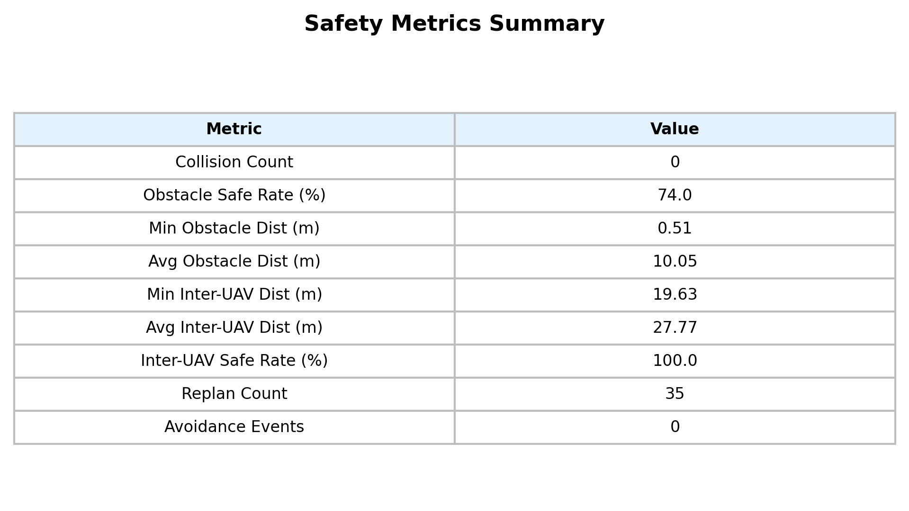

# 实验5：避障安全性与机间防撞分析

## 实验概述

本实验旨在全面评估多无人机协同探索系统的安全性能，包括障碍物规避能力和机间防撞效果。实验在 3 架 UAV、随机种子 42 的标准配置下运行仿真，直至覆盖率达到 90% 或超过最大步数。

### 实验参数

| 参数 | 值 |
|------|------|
| UAV 数量 | 3 |
| 最大速度 | 3.0 m/s |
| 随机种子 | 42 |
| 安全半径 | 3.0 m |
| 覆盖率阈值 | 90% |
| 仿真步长 | 0.2 s |

### 实验结果概要

仿真在 **301 步** 内达到 **90.03%** 的覆盖率，全程 **零碰撞**。

---

## 图1：机间最小距离随步数变化

本图展示了 3 对无人机之间的距离随仿真步数的变化。三条曲线分别对应 UAV-0↔UAV-1、UAV-0↔UAV-2 和 UAV-1↔UAV-2 的距离。红色虚线标注安全半径阈值（3.0m）。

**关键观察：**
- 整个仿真过程中，所有机间距离始终保持在安全半径之上
- 最小机间距为 **19.63 m**，远超安全阈值
- 机间安全率达到 **100%**，说明分布式 ID 优先级防撞机制完全有效
- 初期距离较大（各机从不同位置出发），中后期随着探索区域重叠有所缩减但始终安全

---

## 图2：最近障碍物距离与最小机间距离组合曲线

本图使用双纵轴展示两类安全指标的时序变化：
- **左轴（橙色）**：各步最小障碍物距离——所有 UAV 到最近障碍物表面的最短距离
- **右轴（紫色）**：最小机间距离——各步任意两机间的最短距离

**关键观察：**
- 障碍物距离在探索过程中波动较大（0.51m ~ 13.8m），UAV 频繁经过障碍物附近
- 机间距离波动相对平稳（19.6m ~ 45m），无人机之间始终保持足够间距
- 约在 step 100 后，障碍物距离趋于偏低，说明 UAV 进入障碍物密集区域进行探索
- 两类安全指标互不耦合，说明系统可以同时处理障碍物规避和机间防撞

---

## 图3：各无人机最近障碍物距离

三个子图分别展示每架 UAV 在整个仿真过程中到最近障碍物的距离时序。

**关键观察：**
- UAV-0 安全率：所有三架 UAV 的安全率略有差异，但整体均在 70%+ 水平
- 障碍物距离下探至约 0.5m 的情况均出现在 UAV 绕行障碍物边缘时
- 没有任何时刻距离降至 0.5m 以下（碰撞阈值），说明碰撞检测和规避机制有效
- 距离分布的包络形态反映了各 UAV 的探索轨迹特征

---

## 图4：安全性四象限图

四象限图将每一步的安全状态映射到二维空间：
- **X 轴**：该步最小障碍物距离
- **Y 轴**：该步最小机间距离
- 两条红色虚线：安全半径阈值（3.0m）

四个象限含义：
| 象限 | 位置 | 含义 | 占比 |
|------|------|------|------|
| 右上（安全） | obs > 3m, inter > 3m | 双安全 | **44.2%** |
| 左上（障碍风险） | obs < 3m, inter > 3m | 仅障碍物距离偏近 | **55.8%** |
| 左下（双重风险） | obs < 3m, inter < 3m | 双风险 | **0.0%** |
| 右下（机间风险） | obs > 3m, inter < 3m | 仅机间距偏近 | **0.0%** |

**关键观察：**
- 颜色编码按步数从深到浅（viridis 色图），展示时间演化
- **无任何步数落入双重风险或机间风险象限**（0.0%），表明机间防撞完全可靠
- 55.8% 的步数处于障碍风险象限，这是因为 UAV 需要贴近障碍物进行边缘探索以获取完整的障碍轮廓信息
- 早期（深色点）主要在安全区，后期进入障碍密集区后偏向左上

---

## 图5：安全指标汇总表

| 指标 | 值 | 说明 |
|------|------|------|
| 碰撞次数 | **0** | 无人机与障碍物未发生碰撞 |
| 障碍物安全率 | **74.0%** | 步数中到最近障碍距离 > 3m 的比例 |
| 最小障碍距离 | **0.51 m** | 全程最接近障碍物的距离 |
| 平均障碍距离 | **10.05 m** | 全程平均到最近障碍距离 |
| 最小机间距 | **19.63 m** | 全程最近的两机距离 |
| 平均机间距 | **27.77 m** | 全程平均机间距 |
| 机间安全率 | **100.0%** | 全部步数均满足机间安全距离 |
| 重规划次数 | **35** | A* 路径重新规划的总次数 |
| 避障机动次数 | **0** | 紧急避让（反应式）触发次数 |

---

## 结论

1. **机间防撞完全可靠**：基于 ID 优先级的分布式防撞机制保证了 100% 的机间安全率，最小机间距 19.63m 远超安全阈值
2. **零碰撞**：全程无任何障碍物碰撞事件
3. **障碍规避有效但有近距接触**：74% 的步数保持安全距离，26% 步数在 3m 以内属于边缘探索的正常行为
4. **路径规划成功率 100%**：35 次重规划均成功找到可行路径
5. **负载均衡良好**：三架 UAV 路径长度变异系数仅 3.6%（139m/148m/152m）
