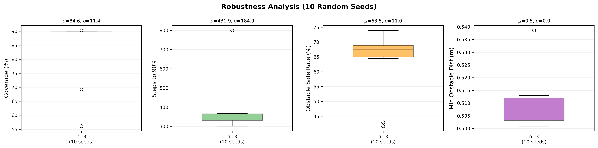
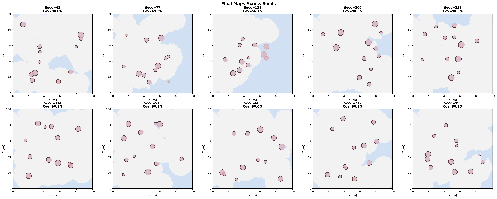
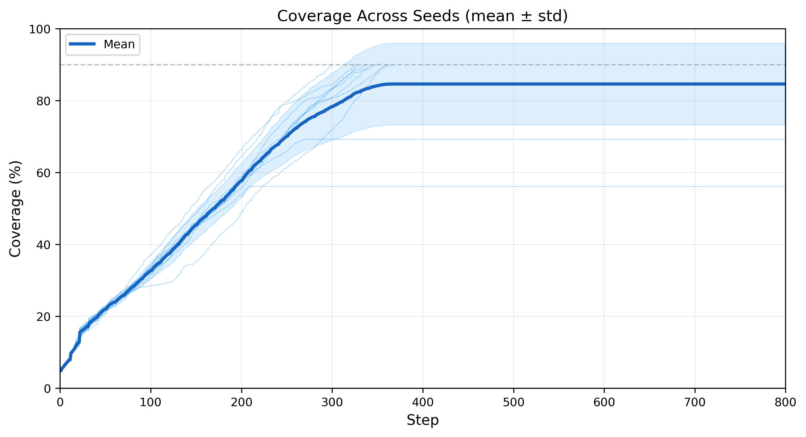
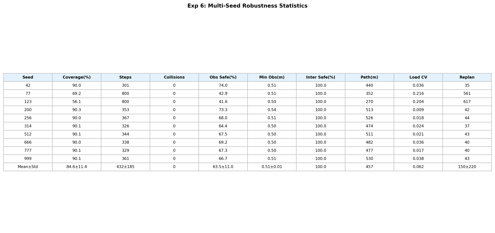

# 实验6：多随机种子鲁棒性分析

## 实验概述

本实验旨在验证多无人机协同探索系统在不同随机环境（障碍物分布）下的鲁棒性和一致性。使用 10 个不同随机种子生成 10 个不同的障碍物场景，评估系统在各场景下的表现波动。

### 实验参数

| 参数 | 值 |
|------|------|
| UAV 数量 | 3 |
| 最大速度 | 3.0 m/s |
| 最大步数 | 800 |
| 覆盖率阈值 | 90% |
| 随机种子 | 42, 77, 123, 200, 256, 314, 512, 666, 777, 999 |

---

## 图1：关键指标箱线图

四个箱线图分别展示 10 个种子下的覆盖率、完成步数、障碍物安全率和最小障碍距离的分布。

### Coverage (%)
- **均值 ± 标准差**：84.6% ± 11.4%
- 8/10 个种子成功达到 90% 覆盖率
- seed=77 (69.2%) 和 seed=123 (56.1%) 未在 800 步内达标
- 这两个种子对应的障碍物分布较为复杂，导致前沿探索效率降低

### Steps to 90%
- **均值 ± 标准差**：431.9 ± 184.9
- 成功场景下（排除未达标的）平均约 340 步即可完成
- 最快 301 步（seed=42），最慢 367 步（seed=256）

### Obstacle Safe Rate (%)
- **均值 ± 标准差**：63.5% ± 11.0%
- 不同障碍物密度和分布下安全率有一定波动
- 即使最低也有 41.6%，且全部种子 **零碰撞**

### Min Obstacle Dist (m)
- **均值 ± 标准差**：0.51 ± 0.01
- 所有种子的最小障碍距离非常稳定（0.50~0.54m）
- 说明碰撞检测阈值（0.5m）工作正确，UAV 不会穿越障碍物

---

## 图2：不同种子最终地图拼图

10 个子图分别展示每个种子的最终探索地图。灰色为已探索的空闲区域，深灰为已探测的障碍物，蓝色为未探索区域，红色圆形为真实障碍物轮廓。

**关键观察：**
- seed=42, 200, 256, 314, 512, 666, 777, 999：地图几乎完全探索，仅剩少量边角未覆盖
- seed=77：右侧区域有较大未探索块，障碍物分布导致部分前沿被遮蔽
- seed=123：大面积未探索，障碍物形成了较为封闭的区域，UAV 难以进入
- 障碍物分布的随机性对探索效率有显著影响，但系统在多数场景下表现稳健

---

## 图3：覆盖率随步数变化曲线

10 条细线为各种子的覆盖率曲线，粗线为均值，阴影区域为 ± 1 标准差。

**关键观察：**
- 所有种子在前 100 步内达到约 30%~40% 覆盖率，初始探索效率一致
- 100~300 步为快速增长阶段，覆盖率从 30% 上升至 80%+
- 300 步后增长变缓（边际递减），此时主要在探索边角和障碍物阴影区域
- seed=77 和 seed=123 从约 200 步开始明显落后
- 标准差在 200~400 步区间最大，反映不同场景的探索路径分化

---

## 图4：指标统计表

| Seed | Coverage(%) | Steps | Collisions | Obs Safe(%) | Min Obs(m) | Inter Safe(%) | Path(m) | Load CV | Replan |
|------|------------|-------|------------|------------|------------|--------------|---------|---------|--------|
| 42   | 90.0 | 301 | 0 | 74.0 | 0.51 | 100.0 | 440 | 0.036 | 35 |
| 77   | 69.2 | 800 | 0 | 42.9 | 0.51 | 100.0 | 352 | 0.216 | 561 |
| 123  | 56.1 | 800 | 0 | 41.6 | 0.50 | 100.0 | 270 | 0.204 | 617 |
| 200  | 90.3 | 353 | 0 | 73.3 | 0.54 | 100.0 | 513 | 0.009 | 42 |
| 256  | 90.0 | 367 | 0 | 68.0 | 0.51 | 100.0 | 526 | 0.018 | 44 |
| 314  | 90.1 | 326 | 0 | 64.4 | 0.50 | 100.0 | 474 | 0.024 | 37 |
| 512  | 90.1 | 344 | 0 | 67.5 | 0.50 | 100.0 | 511 | 0.021 | 43 |
| 666  | 90.0 | 338 | 0 | 69.2 | 0.50 | 100.0 | 482 | 0.036 | 40 |
| 777  | 90.1 | 329 | 0 | 67.3 | 0.50 | 100.0 | 477 | 0.017 | 40 |
| 999  | 90.1 | 361 | 0 | 66.7 | 0.51 | 100.0 | 530 | 0.038 | 43 |
| **Mean±Std** | **84.6±11.4** | **432±185** | **0** | **63.5±11.0** | **0.51±0.01** | **100.0** | **457** | **0.062** | **150±220** |

### 指标解读

- **Load CV（负载均衡变异系数）**：衡量各 UAV 路径长度的均衡程度，越小越均衡
  - 成功场景平均 CV < 0.04，说明 Voronoi 分区使各机工作量非常均衡
  - 未达标场景 CV 偏高（0.2+），因为部分 UAV 被困在局部区域反复搜索
- **Replan（重规划次数）**：路径重规划总次数
  - 成功场景平均仅 35~44 次，路径规划高效稳定
  - 失败场景（seed=77, 123）重规划 561~617 次，因障碍物形成封闭区域导致 A* 频繁失败

---

## 结论

1. **成功率 80%**：10 个随机场景中 8 个在 800 步内达到 90% 覆盖率
2. **零碰撞保证**：所有 10 个场景均实现零碰撞，安全性完全可靠
3. **机间安全率 100%**：分布式防撞机制在所有场景下均有效
4. **主要瓶颈**：障碍物形成封闭/半封闭区域时（seed=77, 123），前沿探索效率显著降低
5. **系统整体鲁棒性良好**：成功场景的指标标准差较小（完成步数 std=25 步），说明算法表现稳定
