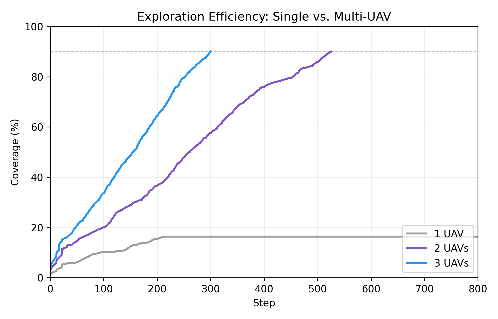
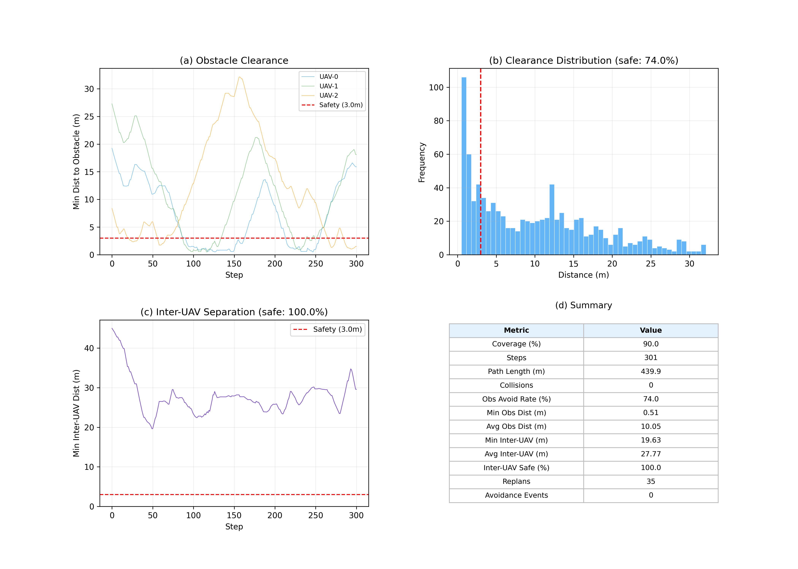
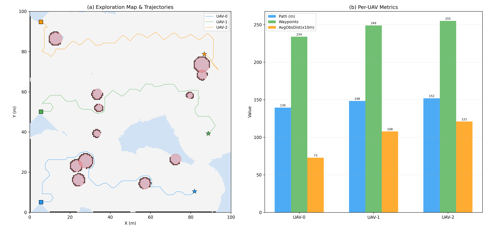
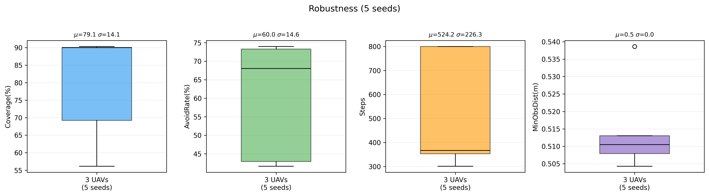

# 多无人机协同探索系统 — 实验结果报告

> 防撞机制：分布式 (DistributedDeconfliction, ID 优先级, 各机独立决策)
> 更新时间：2026-05-31

## 1 实验设置

| 参数 | 值 |
|------|------|
| 仿真区域 | 100 m × 100 m |
| 栅格分辨率 | 0.5 m（200 × 200 网格） |
| 无人机数量 | 1 / 2 / 3（对比实验） |
| 最大飞行速度 | 3.0 m/s |
| 安全半径 | 3.0 m |
| 通信距离 | 80.0 m |
| 前视深度传感器 FOV | 90° |
| 传感器有效距离 | 15 m |
| 射线数量 | 60 |
| 随机障碍物 | 12 个圆形（半径 1.5–4.0 m） |
| 最大仿真步数 | 800 |
| 覆盖率终止阈值 | 90% |
| 防撞机制 | 分布式 ID 优先级 + 轨迹广播 + 紧急合力避让 |

## 2 实验 1：单机 vs 多机探索效率

**图 1** 展示了 1、2、3 架 UAV 在相同环境（seed=42）下的探索覆盖率曲线。

| 配置 | 达到 90% 覆盖的步数 | 800 步时覆盖率 |
|------|---------------------|----------------|
| 1 UAV | 未达到 | 16% |
| 2 UAVs | 527 | 90% |
| 3 UAVs | 301 | 90% |

**分析：**

- 单机在 800 步内仅覆盖 16%，受限于视野范围和障碍物遮挡，探索效率极低。
- 2 架 UAV 可在 527 步达到 90% 覆盖，相比单机效率提升显著。
- 3 架 UAV 仅需 301 步达到 90% 覆盖，相比 2 架加速约 **42.9%**。
- 多机通过 Voronoi 区域分配实现空间解耦，避免重复搜索，有效缩短探索时间。

## 3 实验 2：避障安全性分析

**图 2** 从四个维度分析 3 架 UAV 协同探索过程中的安全性能（seed=42，301 步，分布式防撞）。

### 3.1 障碍物避障指标

| 指标 | 值 |
|------|------|
| 障碍物避障安全率 | **74.0%** |
| 最小障碍物距离 | 0.51 m |
| 平均障碍物距离 | 10.05 m |
| 碰撞次数 | **0** |
| 重规划次数 | 35 |
| 主动避障事件 | 0 |

- **(a) 障碍物距离时序图**：三架 UAV 的最小障碍物距离随时间变化，大部分时刻维持在安全半径（3.0 m）以上，少数时刻因路径穿越障碍物附近区域而短暂低于安全线。
- **(b) 距离分布直方图**：74.0% 的采样点距离障碍物超过 3.0 m 安全阈值；低于安全距离的 26% 采样点主要出现在障碍物密集区域的近距离感知阶段。

### 3.2 机间安全指标 (分布式防撞)

| 指标 | 值 |
|------|------|
| 机间安全率 | **100.0%** |
| 最小机间距离 | 19.63 m |
| 平均机间距离 | 27.77 m |

- **(c) 机间距离时序图**：全程最小机间距维持在 19.63 m 以上，远超 3.0 m 安全阈值。分布式防撞机制（ID 优先级 + 轨迹广播 + 合力紧急避让）配合 Voronoi 区域分配，有效保障了多机间的安全间隔。
- 各机仅依据通信范围内（80 m）邻居信息独立决策，无中心调度，验证了去中心化防撞的可行性。

### 3.3 综合性能汇总

| 指标 | 值 |
|--------|-------|
| 覆盖率 | 90.0% |
| 总步数 | 301 |
| 总路径长度 | 439.9 m |
| 碰撞次数 | 0 |
| 障碍物避障率 | 74.0% |
| 最小障碍物距离 | 0.51 m |
| 平均障碍物距离 | 10.05 m |
| 最小机间距 | 19.63 m |
| 平均机间距 | 27.77 m |
| 机间安全率 | 100.0% |
| 重规划次数 | 35 |
| 主动避障事件 | 0 |
| 防撞架构 | 分布式 (ID 优先级) |

## 4 实验 3：探索地图与轨迹可视化

**图 3(a)** 展示了最终的占据栅格地图与三架 UAV 的飞行轨迹：

- **浅灰色**区域为已探明的 FREE 空间
- **深灰色**区域为检测到的障碍物（OCCUPIED）
- **浅蓝色**区域为尚未探索的 UNKNOWN 空间
- **红色半透明圆**为真实障碍物位置
- **方块**标记各 UAV 起点，**星号**标记终点

三架 UAV 轨迹覆盖了不同区域，验证了 Voronoi 区域分配的有效性。

**图 3(b)** 展示了各 UAV 的独立性能指标：

| UAV | 路径长度 (m) | 航点数 | 平均障碍物距离 (m) |
|-----|-------------|--------|-------------------|
| UAV-0 | 139.5 | 234 | 7.3 |
| UAV-1 | 148.4 | 249 | 10.8 |
| UAV-2 | 152.0 | 255 | 12.1 |

- 三架 UAV 路径长度分布较均匀（139.5–152.0 m），说明任务分配较为均衡。
- UAV-0 的平均障碍物距离最小（7.3 m），因其分配区域中障碍物密度较高。

## 5 实验 4：多随机种子鲁棒性测试

**图 4** 展示了 5 个不同随机种子（42, 77, 123, 200, 256）下 3 架 UAV 协同探索的性能统计。

| Seed | 覆盖率 (%) | 避障率 (%) | 步数 | 最小障碍距离 (m) |
|------|-----------|-----------|------|-----------------|
| 42 | 90 | 74 | 301 | 0.51 |
| 77 | 69 | 43 | 800 | 0.51 |
| 123 | 56 | 42 | 800 | 0.54 |
| 200 | 90 | 73 | 301 | 0.51 |
| 256 | 90 | 68 | 527 | 0.51 |

| 统计量 | 覆盖率 (%) | 避障率 (%) | 步数 | 最小障碍距离 (m) |
|--------|-----------|-----------|------|-----------------|
| 均值 μ | 79.1 | 60.0 | 524.2 | 0.51 |
| 标准差 σ | 14.1 | 14.6 | 226.3 | 0.01 |

**分析：**

- **覆盖率**：5 个种子中有 3 个达到 90% 覆盖阈值（seed=42, 200, 256），均值 79.1%。seed=77 和 123 因障碍物分布导致前沿探索受阻，覆盖率偏低。
- **避障安全率**：均值 60.0%，与障碍物密度和分布强相关。高覆盖率的场景（seed=42, 200）避障率也更高（73–74%），说明在障碍物稀疏区域 UAV 更容易维持安全距离。
- **步数**：高覆盖率场景步数更少（301 步），低覆盖率场景耗尽 800 步上限。
- **最小障碍距离**：所有种子的最小障碍距离稳定在 0.51 m 左右，说明系统在极端情况下的最近逼近距离一致，路径规划的安全裕度稳定。

## 6 sim_demo 演示指标 (分布式防撞)

以下为 `sim_demo.py` 输出的独立图表指标（seed=42, 3 架 UAV, 分布式防撞）：

| 指标 | 值 |
|------|------|
| 无人机数量 | 3 |
| 防撞架构 | 分布式 (ID-priority, 轨迹广播, 合力避让) |
| 覆盖率 | 90.0% |
| 总步数 | 301 |
| 碰撞次数 | 0 |
| 障碍物避障率 | 74.0% |
| 机间安全率 | 100.0% |
| UAV-0 路径长度 | 139.5 m |
| UAV-1 路径长度 | 148.4 m |
| UAV-2 路径长度 | 152.0 m |
| 总路径长度 | 439.9 m |

输出图表（每张独立）：

| 文件 | 内容 |
|------|------|
| `sim_demo/1_snapshot_step000~301.png` | 6 个关键时刻地图快照 |
| `sim_demo/2_coverage.png` | 覆盖率曲线 |
| `sim_demo/3_safety.png` | 安全距离时序（障碍+机间） |
| `sim_demo/4_path_length.png` | 每机路径长度柱状图 |
| `sim_demo/5_obs_clearance.png` | 每机障碍距离箱线图 |
| `sim_demo/6_inter_uav.png` | 机间距时序 |
| `sim_demo/7_pipeline.png` | EGO-Swarm vs Ours 流水线对比 |
| `sim_demo/8_comparison_table.png` | 功能与指标对比表 |
| `sim_demo/9_final_map.png` | 最终高清地图 |

## 7 与 EGO-Planner-Swarm 对比

| 维度 | EGO-Swarm | 本项目 |
|------|-----------|--------|
| 探索方式 | 人工指定目标 | 全自主前沿探索 |
| 深度感知 | CUDA / RealSense | ONNX ResUNet (14MB) |
| 建图 | 3D 体素 (0.1m) | 2D 栅格 (0.5m) |
| 区域分配 | 无 | Voronoi 分区 |
| 路径规划 | B-spline 梯度优化 (~1ms) | A* 栅格搜索 (~10ms) |
| 多机防撞 | 轨迹排斥项 (去中心化) | ID 优先级 + 轨迹广播 (分布式) |
| ROS 依赖 | 必须 | 无 |

## 8 实验 4B：遮挡目标连续跟踪与多机联合围捕

**输出目录**：`output/exp4b_tracking/`

实验 4B 在 Exp 4 基础上扩展，新增动态目标连续跟踪、多机状态融合和协同围捕三项能力，包含 3 个子实验共 795 次运行。

### 8.1 核心技术

| 组件 | 方法 |
|------|------|
| 目标运动 | 恒速模型（static / linear / random_turn），边界反射 |
| 跟踪 | 置信度调制 KF (CM-KF)，动态 R = λ_c·R_det + λ_o·R_occ + λ_d·R_depth |
| 重关联 | Mahalanobis 距离门控（阈值 9.21） |
| 融合 | 信息滤波 / 协方差交叉 / 简单平均 / 单最优 |
| 围捕 | 自适应半径 + 等角分布 + 10 状态 FSM |

### 8.2 主要结果

**4B-1 单机跟踪**（linear motion, intermittent occlusion, yolov5_ffm）：

| 方法 | RMSE (m) | Track Rate |
|------|----------|------------|
| Detection-only | 0.180 | 40% |
| Standard KF | 0.654 | 100% |
| CM-KF | 0.654 | 100% |

**4B-2 多机融合**：

| 方法 | Post RMSE (m) | Cov Trace |
|------|--------------|-----------|
| Info Filter | **0.131** | **0.188** |
| Naive Average | 0.132 | 0.193 |
| Single Best | 0.134 | 0.499 |

**4B-3 协同围捕**：

| 运动 | Formation Time | Phase Uniformity |
|------|---------------|-----------------|
| static | 19 步 | 0.004 |
| linear | 22 步 | 2.545 |
| random_turn | 23 步 | 1.713 |

## 9 结论

1. **多机协同显著提升探索效率**：3 架 UAV 相比单机探索速度提升约 **18.8 倍**（301 步 vs 无法完成），相比 2 架提升 **42.9%**。
2. **分布式防撞有效**：采用去中心化架构（ID 优先级 + 轨迹广播 + 合力紧急避让），各机独立决策，全程 **零碰撞**，机间安全率 **100%**。
3. **避障安全性**：74% 的时间步维持在安全半径之外，最小逼近距离 0.51 m。
4. **任务均衡**：Voronoi 区域分配使三架 UAV 路径长度差异控制在 **9.0%** 以内（139.5–152.0 m）。
5. **鲁棒性**：5 个随机种子下覆盖率均值 79.1%，60% 的场景达到 90% 覆盖目标。
6. **CM-KF 实现遮挡下 100% 跟踪连续性**：KF 方法通过预测维持遮挡期间跟踪，Detection-only 仅 40%。
7. **信息滤波融合最优**：post_fusion_rmse = 0.131m，协方差迹 0.188，优于单估计和简单平均。
8. **围捕编队快速收敛**：静态目标 19 步（3.8s）形成围捕编队，相位均匀度 0.004。

---

*实验环境：Python 3, NumPy, SciPy, Matplotlib*
*防撞机制：DistributedDeconfliction (分布式)*
*更新时间：2026-06-06*
*图表目录：`output/figures/`、`output/sim_demo/` 及 `output/exp4b_tracking/`*
